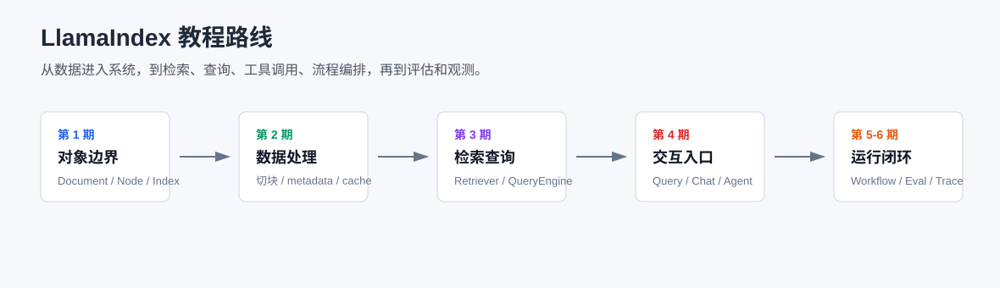

# LlamaIndex 教程



这个系列不是把 LlamaIndex API 逐个过一遍，而是按一个 RAG 系统从 Demo 到可维护应用的顺序来写：

```text
对象边界 -> 数据处理 -> 检索查询 -> 交互入口 -> 流程编排 -> 评估观测
```

主线 6 期讲完整路径，后面的进阶篇按“一个问题，一个最小可运行能力”的方式继续拆。

## 目录结构

```text
llamaindex/
├── README.md
├── .env example
├── data/
│   └── example_docs/          # 本地示例文档
├── docs/                      # Markdown 教程
├── images/                    # 教程配图
└── code/                      # 配套代码与每期示例
```

## 环境准备

```bash
pip install -r requirements.txt
```

如果需要使用 OpenAI 兼容接口，可以复制 `.env example` 为 `.env`，并填写：

```bash
OPENAI_API_KEY=""
OPENAI_BASE_URL=""
OPENAI_MODEL=""
LLAMAINDEX_CONTEXT_WINDOW="32768"
EMBEDDING_MODEL=""
```

## 教程列表

### 主线篇

1. [先看懂 LlamaIndex 的架构边界](docs/01-architecture-boundary.md)
2. [数据进入系统之前，RAG 已经决定了一半效果](docs/02-ingestion-pipeline.md)
3. [VectorStoreIndex 不是终点，Retriever 才是 RAG 的控制面](docs/03-index-retriever-query-engine.md)
4. [Query Engine、Chat Engine、Agent 的边界](docs/04-query-chat-agent.md)
5. [Workflows：把多步骤 RAG 显式编排出来](docs/05-workflows.md)
6. [生产化：评估、观测与可替换架构](docs/06-production-evaluation-observability.md)

### 进阶篇

7. [LlamaIndex 实战：RAG 答不准怎么办？先做一个检索诊断器](docs/07-advanced-retrieval.md)
8. [LlamaIndex 实战：向量检索解决不了关系问题？试试最小 GraphRAG](docs/08-graphrag-property-graph.md)
9. [LlamaIndex 实战：PDF 进知识库前要检查什么？先做文档解析验收](docs/09-document-parsing.md)
10. [LlamaIndex 实战：用 Workflow 管住 RAG 的检索、重试和工单动作](docs/10-agent-workflow-advanced.md)

## 运行示例

```bash
cd llamaindex

# 第 1 期：架构边界
python code/01_architecture/01_minimal_rag.py
python code/01_architecture/02_document_to_node.py
python code/01_architecture/03_settings_and_source_debug.py

# 第 2 期：IngestionPipeline
python code/02_ingestion/01_basic_splitter.py
python code/02_ingestion/02_metadata_ingestion.py
python code/02_ingestion/03_ingestion_cache.py
python code/02_ingestion/04_chunk_size_compare.py
python code/02_ingestion/05_splitter_strategy_compare.py

# 第 3 期：Index / Retriever / QueryEngine
python code/03_querying/01_default_query_engine.py
python code/03_querying/02_explicit_retriever.py
python code/03_querying/03_custom_query_engine.py
python code/03_querying/04_node_postprocessor.py
python code/03_querying/05_persist_and_reload.py

# 第 4 期：QueryEngine / ChatEngine / Agent
python code/04_engines_agents/01_query_engine.py
python code/04_engines_agents/02_chat_engine.py
python code/04_engines_agents/03_query_engine_tool.py
python code/04_engines_agents/04_function_agent.py

# 第 5 期：Workflows
python code/05_workflows/01_basic_workflow.py
python code/05_workflows/02_multi_step_rag_workflow.py
python code/05_workflows/03_branching_workflow.py

# 第 6 期：评估和观测
python code/06_production/01_fixed_question_set.py
python code/06_production/02_response_evaluation.py
python code/06_production/03_retrieval_evaluation.py
python code/06_production/04_trace_callback.py

# 进阶 1：RAG 检索诊断器
python code/07_advanced_retrieval/01_topk_baseline.py
python code/07_advanced_retrieval/02_metadata_filter.py
python code/07_advanced_retrieval/03_query_fusion.py
python code/07_advanced_retrieval/04_keyword_rerank.py

# 进阶 2：最小关系问答系统
python code/08_graphrag/01_property_graph_index.py
python code/08_graphrag/02_compare_vector_and_graph.py
python code/08_graphrag/03_manual_relationship_baseline.py
python code/08_graphrag/04_relationship_qa_app.py

# 进阶 3：文档解析质量检查器
python code/09_document_parsing/01_parse_result_check.py
python code/09_document_parsing/02_llamaparse_optional.py
python code/09_document_parsing/03_clean_parse_result.py
python code/09_document_parsing/04_parse_quality_gate.py

# 进阶 4：受控 RAG 工作流
python code/10_agent_workflow_advanced/01_multi_tool_agent.py
python code/10_agent_workflow_advanced/02_workflow_with_review.py
python code/10_agent_workflow_advanced/03_workflow_retry.py
python code/10_agent_workflow_advanced/04_support_case_workflow.py
```

这些代码优先保持清晰，不追求一次覆盖所有高级参数。像 LlamaParse 这类需要额外服务或依赖的能力，会在代码里做提示，不让示例变成一跑就报错。
