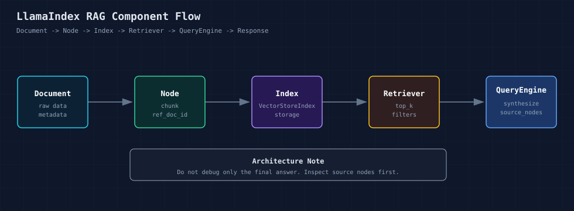

# LlamaIndex（一）：学 LlamaIndex 之前，先看懂它在 RAG 里的位置

这一年做 AI 应用的人，大多会有一个共同感受：东西更新得太快了。

前面我们已经写过 LangChain 和 LangGraph。刚把链式调用、工具调用、状态图、多步骤 Agent 这些概念理顺，新的项目又不断出现。像 OpenClaw、Hermes Agent 这类 Agent 工程框架出来之后，很容易让人产生一种焦虑：是不是刚学完一个东西，又要马上换到下一个？

这种感觉很正常。AI 应用层确实还在快速变化，尤其是 Agent、Workflow、多工具调用、本地记忆、浏览器自动化这些方向，几乎每隔一段时间就会出现新的方案。

但越是在这种阶段，越不能只跟着项目名字跑。

我自己看这些框架时，也经常提醒自己一件事。

**真正值得学的，不是某个框架今天的 API 写法，而是它背后反复出现的工程问题。**

LangChain 让我们理解 LLM 应用如何组件化，Prompt、模型、工具、链路应该怎么组织。LangGraph 进一步把多步骤任务、状态流转、人机交互和多智能体协作显式化，让复杂流程不再只是一串函数调用。

到了 RAG、知识库问答、文档助手、企业内部搜索这些场景，又会遇到另一个更基础的问题：数据到底应该怎么进入 LLM 应用？

最开始做 Demo 时，这件事看起来很简单：读取文档、切分文本、生成向量、存进向量数据库，再把检索结果交给大模型回答。几十行代码就能跑通。

但真正进入工程阶段后，问题会很快出现。

文档更新后，索引怎么同步？

不同用户的数据怎么隔离？

检索结果不准时，应该改切分、改 Embedding、改 top_k，还是改 Prompt？

回答出错时，怎么知道模型参考了哪些上下文？

后面要接入 Agent、Workflow、评估和观测时，代码应该怎么拆？

这些问题不是单个 API 能解决的，它们本质上是数据架构问题。

这也是我们单独写 LlamaIndex 系列的原因。它不只是向量数据库的封装，也不是“又一个 RAG 工具包”。更准确地说，LlamaIndex 是一个面向 LLM 应用的数据框架：负责把业务数据转成模型可以使用的上下文，并围绕这条链路提供加载、切分、索引、检索、查询、对话、智能体、工作流、评估和观测等能力。

所以这个系列我不想从“某个函数怎么调用”开始。

更合适的写法，是先把问题摆出来：它解决的工程问题是什么，LlamaIndex 里对应的核心抽象是什么，这些抽象落到代码里又长什么样。

学这些框架，不是为了记住每个 API，而是为了在新项目不断出现的时候，能看懂它们到底换了哪一层、保留了哪一层、重新包装了哪一层。

第一篇先不急着讲高级能力。

我们先看一个最基础的问题：一个最小 RAG 程序，在 LlamaIndex 里到底经过了哪些组件？



如果你是第一次接触 LlamaIndex，不用急着把图里的每个名词都记下来。

先抓住一个简单判断就够了：

**LlamaIndex 不是直接“替你问模型”，而是先帮你把资料整理成可检索、可引用、可追踪的结构，然后再把相关上下文交给模型。**

后面的代码也会按这个顺序走：先跑通最小问答，再把中间对象拆出来看。

这个系列后面会沿着一条主线展开：

```text
对象边界 -> 数据处理 -> 检索查询 -> 交互入口 -> 流程编排 -> 评估观测
```

这一篇只先把 `Document`、`Node`、`Index`、`Retriever`、`QueryEngine` 这些名字摆正。第二篇会继续往下看：文档进入索引之前，应该怎样切分、补 metadata、做缓存。

## 01 LlamaIndex 负责什么

先把视角放宽一点。一个 LLM 应用通常会包含这些部分：

- LLM：负责生成文本。
- Embedding：负责把文本转成向量。
- Vector Store：负责向量存储和相似度检索。
- Data Loading：负责从文件、数据库、API、网页、SaaS 系统读取数据。
- Data Processing：负责清洗、切分、补充元数据。
- Query Orchestration：负责把问题、上下文和生成过程组织起来。
- Evaluation / Observability：负责评估、追踪、调试和监控。

LlamaIndex 的位置不是替代 LLM，也不是替代向量数据库。

**它的核心价值，是把这些组件组织成一条可维护的数据使用链路。**

刚开始可以把 LlamaIndex 理解成“LLM 应用里的数据组织层”。

模型负责生成，向量库负责存储和相似度检索，而 LlamaIndex 负责把文档、切分片段、索引、检索器和查询入口串起来。


这条链路是后续学习 LlamaIndex 的主线。

## 02 几个核心对象的职责

下面这些对象后面会反复出现。

第一次看不用追求一次记住所有细节，先知道它们各自站在哪个位置。

**Document**

`Document` 表示进入系统的原始资料。它可以来自本地文件，也可以来自数据库、对象存储、网页、Notion、Slack、GitHub 等外部系统。

你可以先把它理解成“刚读进来的资料”。

**Node**

`Node` 是切分后的文本单元。RAG 真正检索的通常不是完整文档，而是一个个 Node。Node 里除了文本，还可以保存元数据、关系和原始文档引用。

如果 Document 是一整份资料，Node 就是后续真正拿去检索的小片段。

**Index**

`Index` 负责组织 Node。最常见的是 `VectorStoreIndex`，它会把 Node 向量化，并放入向量存储。

**Retriever**

`Retriever` 负责根据用户问题找出相关 Node。检索质量首先取决于 Node 切分、Embedding、top_k、过滤条件和排序策略。

**QueryEngine**

`QueryEngine` 是查询入口。它通常会调用 Retriever，再把问题和检索结果交给 LLM 生成回答。

**Response**

`Response` 是最终响应。它不只包含答案，还可以包含 `source_nodes`。

调试 RAG 时，source nodes 是第一入口。

## 03 为什么要看 core 和 integrations

LlamaIndex 当前采用 core + integrations 的组织方式。

`llama-index-core` 放基础抽象和通用能力，比如 schema、indices、retrievers、query_engine、ingestion、storage、workflow、llms、embeddings 等。

具体模型、向量库、Reader、Tool、观测工具等能力放在 integrations 包中。

这个设计有几个工程含义：

- 核心抽象尽量稳定。
- 外部依赖按需安装，避免引入大量无关包。
- 业务代码可以依赖 LlamaIndex 抽象，而不是直接绑死某个模型服务或向量库。
- 后续替换 LLM、Embedding、Vector Store 时，影响范围更可控。

所以在生产项目里，不建议在业务函数里到处初始化模型、向量库和 Reader。更合理的方式是把这些放到基础设施层或工厂函数里，业务层只面对 QueryEngine、Retriever 或应用服务接口。

## 04 示例 1：最小 RAG

第一个示例先不拆太细，只看最短路径。

跑完以后，先观察两件事：

第一，代码确实可以基于本地文档回答问题。

第二，回答后面带着 `source_nodes`，也就是这次回答参考了哪些文本片段。

**代码位置**

```text
code/01_architecture/01_minimal_rag.py
```

**运行命令**

```bash
cd llamaindex
python code/01_architecture/01_minimal_rag.py
```

**核心代码**

```python
documents = load_example_documents()
index = VectorStoreIndex.from_documents(documents)
query_engine = index.as_query_engine(similarity_top_k=2)

response = query_engine.query("LlamaIndex 在 RAG 系统中负责什么？")
```

这段代码里有几个名字先认一下：

- `load_example_documents()`：我们自己在 `common.py` 里封装的辅助函数，内部用 `SimpleDirectoryReader` 读取 `data/example_docs` 下的示例文档。
- `VectorStoreIndex.from_documents()`：LlamaIndex 提供的索引构建入口。它会把 Document 转成 Node，并基于 Embedding 构建向量索引。
- `index.as_query_engine()`：从索引创建一个查询入口。后面你只需要对它调用 `query()`。
- `similarity_top_k=2`：每次查询时取回最相关的 2 个 Node。
- `response.source_nodes`：这次回答参考的原始片段。调试 RAG 时要重点看它。

这段代码很短，但它内部已经经过了读取文档、切分 Node、构建索引、创建查询入口、检索上下文和生成回答几个步骤。

这里要注意一个点：最小 RAG 不是生产架构，它只是把默认路径跑通。生产系统需要把这些步骤拆开管理。

## 05 示例 2：单独观察 Document 到 Node

第二个示例开始拆内部对象。

LlamaIndex 并不是直接拿整篇文档去检索，而是会先把文档切成更小的片段。这个片段就是 `Node`。

**代码位置**

```text
code/01_architecture/02_document_to_node.py
```

这段代码使用 `SentenceSplitter` 显式把 Document 切成 Node：

```python
documents = load_example_documents()
splitter = SentenceSplitter(chunk_size=160, chunk_overlap=30)
nodes = splitter.get_nodes_from_documents(documents)
```

这里重点看 `SentenceSplitter`。

它是 LlamaIndex 里的文本切分器，负责把一整份 Document 切成多个 Node。

参数也先看两个：

- `chunk_size=160`：每个 Node 大致多长。
- `chunk_overlap=30`：相邻 Node 之间保留多少重叠内容，避免一句话刚好被切断。

运行后重点看三个字段：

- `node_id`：Node 自己的唯一标识。
- `ref_doc_id`：Node 来自哪个 Document。
- `metadata`：Node 携带的来源信息。

如果一个 RAG 系统不能追踪 Node 来自哪个文档，后面就很难做溯源、权限过滤、数据更新和质量排查。

## 06 示例 3：Settings 和 source_nodes

第三个示例看一个很实用的调试入口。

刚开始做 RAG 时，我们很容易只盯着最终回答。但真实排查时，应该先看模型到底参考了哪些上下文。

**代码位置**

```text
code/01_architecture/03_settings_and_source_debug.py
```

这里关注两个点。

第一，`Settings` 统一配置 LLM 和 Embedding：

```python
print(f"llm={type(Settings.llm).__name__}")
print(f"embed_model={type(Settings.embed_model).__name__}")
```

`Settings` 是 LlamaIndex 的全局配置对象。

在我们的代码里，`configure_llamaindex()` 会从 `.env` 读取 `OPENAI_BASE_URL`、`OPENAI_API_KEY`、`OPENAI_MODEL`、`EMBEDDING_MODEL`，然后写入 `Settings.llm` 和 `Settings.embed_model`。

后面构建索引、生成回答时，LlamaIndex 会从 `Settings` 里拿这些配置。

生产代码里，LLM 和 Embedding 不应该散落在每个业务函数里。统一配置可以降低替换模型和排查问题的成本。

第二，打印 `response.source_nodes`：

```python
for source_node in response.source_nodes:
    print(source_node.score)
    print(source_node.node.metadata)
    print(source_node.node.get_content())
```

RAG 调试不要只看最终回答。

**应该先看 source nodes 是否正确。**

如果上下文错了，后面再调 Prompt 意义不大。

## 07 写 Demo 和做系统，是两种写法

从第一期开始，可以把 LlamaIndex 项目拆成四层：

```text
数据接入层：Reader、Document、外部数据源适配
数据处理层：Node Parser、Transformation、Embedding、Index Builder
查询服务层：Retriever、QueryEngine、ChatEngine、Agent Tool
质量治理层：Evaluation、Tracing、Observability
```

这个拆法不复杂，但能避免后续代码快速膨胀。

如果只是写 Demo，可以直接使用 `VectorStoreIndex.from_documents()` 和 `index.as_query_engine()`。

如果要做真实系统，建议至少把数据处理、索引构建、查询服务拆成独立模块，并记录 source nodes。

## 08 本期小结

本期要记住的不是某个 API，而是 LlamaIndex 的主链路：

```text
Document -> Node -> Index -> Retriever -> QueryEngine -> Response
```

这个链路后面会反复出现。第 2 期会进入数据处理层，重点讲 IngestionPipeline。第 3 期会进入查询层，拆开 Retriever 和 QueryEngine。

## 参考资料

- LlamaIndex 官方文档：https://developers.llamaindex.ai/python/framework/
- LlamaIndex GitHub 仓库：https://github.com/run-llama/llama_index
