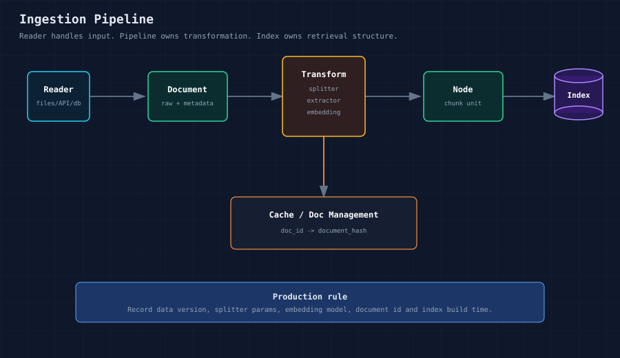

# LlamaIndex（二）：RAG 文档切块，不只是调 chunk_size

很多 RAG 系统效果不稳定，第一反应通常是改 Prompt、换模型、调 top_k。实际排查时经常会发现，问题更早发生在数据处理阶段：文档切分不合理，元数据缺失，索引和原始数据无法对应，线上数据更新后索引没有同步。

所以这一篇我们先不急着看查询。

先看数据怎么进入系统。

LlamaIndex 里负责这件事的核心能力，是 `IngestionPipeline`。它的重点不是“把文档读进来”这么简单，而是把原始资料处理成后续检索可用、可追踪、可更新的 Node。



如果你刚开始做 RAG，可以先把 ingestion 理解成“资料入库前的加工过程”。它不是简单读取文件，而是要决定文档怎么切、元数据怎么补、向量什么时候生成、重复处理怎么避免。

其中最容易被低估的一步，就是文档切块。

很多人一开始会把切块理解成调两个参数：`chunk_size` 和 `chunk_overlap`。这当然有用，但不完整。

不同资料形态，适合的切块方式是不一样的。

这一篇会比第一篇更接近工程实践。

因为很多 RAG 问题不是出在模型生成阶段，而是出在资料进入系统之前。

这一篇接的是第一篇里的 `Document -> Node -> Index`。

第一篇先认识对象，这一篇只盯住其中最容易影响效果的一段：`Document` 怎么变成 `Node`。第三篇会继续往后走：Node 已经进了索引以后，Retriever 怎样把它们取出来。

## 01 为什么 ingestion 要单独设计

最小 Demo 里，我们经常会这样写：

```python
documents = SimpleDirectoryReader("data").load_data()
index = VectorStoreIndex.from_documents(documents)
```

这段代码能跑。

问题在于，它把读取、切分、向量化、索引构建都压缩在一起了。真实项目里很快会遇到几个问题：

- 不知道每个 Node 是怎么切出来的。
- 切分参数无法复现。
- 缺少 metadata，后续不能按来源、租户、权限、时间过滤。
- 数据更新后不知道哪些 Node 需要重建。
- Embedding 模型切换后，很难管理索引版本。

所以 ingestion 应该被设计成一个独立任务：


**Reader 负责读取。Pipeline 负责加工。Index 负责组织和检索。**

这句话很关键。

刚入门时可以把三者混在一起写。真实项目里最好拆开，因为读取方式、加工策略和索引结构的变化频率并不一样，放在一起会让后续维护变难。

## 02 Document 和 Node 的区别

`Document` 是进入系统的文档对象，通常对应一个文件、一条数据库记录或一个外部系统返回的文档。

`Node` 是用于检索的最小文本单元。一个 Document 往往会切成多个 Node。

生产环境里，Node 往往比 Document 更需要关注。

原因也简单：用户查询时，系统检索和引用的是 Node。如果 Node 切分不合理，后面的 Retriever 和 LLM 都只能在不理想的上下文上工作。

一个 Node 至少需要关注：

- 文本内容：参与检索和生成。
- 元数据：来源、业务 ID、租户、权限、时间、分类。
- 关系信息：来自哪个 Document，前后 Node 是什么。

这些信息决定后续能否过滤、溯源、评估和增量更新。

## 03 IngestionPipeline 的能力

LlamaIndex 的 IngestionPipeline 通过 Transformation 处理输入数据。常见能力包括：

- 文本切分：如 `SentenceSplitter`、`TokenTextSplitter`。
- 元数据抽取：如标题、摘要、关键词。
- Embedding：把 Node 转成向量。
- Cache：缓存 transformation 结果，避免重复计算。
- Document Management：基于 `doc_id` 和 hash 判断重复或变化。
- Parallel Processing：使用 `num_workers` 并行处理。
- Async Support：使用 `arun` 支持异步 ingestion。

不是每个项目一开始都需要全部能力。

但这些能力说明了一件事：ingestion 本身就是系统层能力，不只是一个临时脚本。

这里的 `Transformation` 可以先理解成“对文档或 Node 做加工的步骤”。比如切分器是一种 Transformation，元数据抽取是一种 Transformation，Embedding 也可以是其中一步。

## 04 切块不是只有一种方法

切块策略要看文档类型和查询方式。

如果是普通说明文档，按句子或段落切通常就够了。

如果是代码文档、API 文档、Markdown 文档，最好尽量保留标题、列表、代码块这些结构。

如果是 FAQ 或短句密集的材料，可以考虑 sentence window，让每个句子检索时带上前后文。

如果文档段落很长，而且语义边界不明显，可以考虑 semantic splitter，让 embedding 帮你判断哪里更适合断开。

常见策略可以先这样理解：

| 切块方式 | 适合场景 | 注意点 |
| --- | --- | --- |
| `SentenceSplitter` | 普通文章、说明文档、教程 | 尽量保留完整句子，比纯 token 切分更自然 |
| `TokenTextSplitter` | 需要严格控制长度的文本 | 更机械，可能切断句子 |
| `SentenceWindowNodeParser` | FAQ、短句、需要前后文的问题 | 检索粒度细，但回答时可带上窗口上下文 |
| `SemanticSplitterNodeParser` | 段落较长、语义边界不明显的文档 | 需要 Embedding，成本更高 |
| `MarkdownElementNodeParser` | Markdown、表格、结构化文档 | 更适合保留文档结构，复杂度也更高 |

所以第二篇不是只讲“按照块大小切”。

更准确地说，我们是在讲：**如何把原始文档切成适合检索的 Node。**

## 05 示例 1：基础切分

第一个示例只做一件事：把文档切成 Node。

运行后主要看两点：`documents` 和 `nodes` 的数量变化，以及每个 Node 的文本内容是否还算完整。

**代码位置**

```text
code/02_ingestion/01_basic_splitter.py
```

**运行命令**

```bash
cd llamaindex
python code/02_ingestion/01_basic_splitter.py
```

**核心代码**

```python
pipeline = IngestionPipeline(
    transformations=[
        SentenceSplitter(chunk_size=120, chunk_overlap=20),
    ]
)
nodes = pipeline.run(documents=documents)
```

这里先把几个 API 讲清楚：

- `IngestionPipeline`：数据处理流水线。它接收 Document，按 transformations 里的步骤加工，最后输出 Node。
- `SentenceSplitter`：文本切分器，把长文档切成更适合检索的小片段。
- `pipeline.run()`：执行整个 ingestion 流程。
- `nodes`：切分后的结果，也是后续索引和检索真正面对的对象。

这个示例重点看 Document 数量和 Node 数量的变化。

如果 Node 数量过少，说明切分较粗，检索命中后可能带入较多无关内容。如果 Node 数量过多，说明切分较细，可能切断完整语义，也会增加索引体积和召回噪声。

## 06 示例 2：metadata ingestion 和过滤

第二个示例加上 metadata。

刚开始很多人会把 metadata 当成可有可无的附加信息，但在真实系统里，它通常是权限、租户隔离、来源追踪和检索过滤的基础。

**代码位置**

```text
code/02_ingestion/02_metadata_ingestion.py
```

这段代码给每个 Document 补充业务元数据：

```python
document.metadata["course"] = "llamaindex"
document.metadata["source_type"] = "local_markdown"
document.metadata["document_name"] = file_name
document.metadata["tenant_id"] = "demo_tenant"
```

`metadata` 是挂在 Document 或 Node 上的结构化信息。

它不会直接改变文本内容，但会影响后续检索、过滤和溯源。

然后在 Retriever 里使用 metadata filter：

```python
filters = MetadataFilters(
    filters=[
        MetadataFilter(key="course", value="llamaindex"),
        MetadataFilter(key="tenant_id", value="demo_tenant"),
    ]
)
retriever = index.as_retriever(similarity_top_k=3, filters=filters)
```

这里用到两个对象：

- `MetadataFilter`：单个过滤条件，例如 `course == "llamaindex"`。
- `MetadataFilters`：多个过滤条件的组合。

metadata 不是展示字段，而是生产系统的控制字段。

**多租户隔离、权限过滤、按文档类型检索、按更新时间检索，都依赖 metadata。**

如果一开始没有设计 metadata，后面补会很麻烦。因为 Node 已经生成，向量也可能已经写入向量库。

## 07 示例 3：IngestionCache

第三个示例看缓存。

这个能力一开始可能不明显，但只要数据量变大，重复切分和重复 Embedding 就会变成实实在在的时间和成本问题。

**代码位置**

```text
code/02_ingestion/03_ingestion_cache.py
```

核心代码：

```python
cache = IngestionCache(collection="llamaindex_tutorial_cache")
pipeline = IngestionPipeline(
    transformations=[
        SentenceSplitter(chunk_size=120, chunk_overlap=20),
    ],
    cache=cache,
)

first_nodes = pipeline.run(documents=documents)
second_nodes = pipeline.run(documents=documents)
```

`IngestionCache` 用来缓存 transformation 的处理结果。

如果输入文档和处理步骤没变，下一次执行时就可以复用之前的结果，减少重复切分和重复 Embedding。

缓存的价值不是让 Demo 快一点，而是让 ingestion 任务可重复执行。

真实项目里，数据量可能很大，Embedding 成本也不低。如果每次都从头处理，成本和时间都不可控。

官方文档也提供了远程缓存思路，比如 Redis、MongoDB、Firestore。生产环境通常不会只用内存缓存，而是会把缓存和文档管理结合起来。

## 08 示例 4：对比 chunk 参数

第四个示例用两组切分参数做对比。

这里不要急着找“标准答案”。更重要的是学会观察：参数变化后，Node 数量怎么变，检索命中的内容怎么变。

**代码位置**

```text
code/02_ingestion/04_chunk_size_compare.py
```

这个示例使用两组参数：

```python
configs = [
    {"chunk_size": 80, "chunk_overlap": 10},
    {"chunk_size": 180, "chunk_overlap": 30},
]
```

每组参数都会重新生成 Node、构建索引、执行检索，并打印命中的 Node。

这个示例的目的不是找一个通用最优参数，而是建立一个判断方法：

- chunk 太小，召回片段可能缺少完整上下文。
- chunk 太大，召回片段可能包含太多无关信息。
- overlap 可以缓解语义被切断的问题，但会增加重复内容。
- 参数选择要用固定问题集评估，不要凭一次测试决定。

## 09 示例 5：对比不同切块策略

**代码位置**

```text
code/02_ingestion/05_splitter_strategy_compare.py
```

这个示例会对比几种不同切块方式：

```python
splitters = {
    "SentenceSplitter": SentenceSplitter(chunk_size=160, chunk_overlap=30),
    "TokenTextSplitter": TokenTextSplitter(chunk_size=160, chunk_overlap=30),
    "SentenceWindowNodeParser": SentenceWindowNodeParser.from_defaults(
        window_size=2,
        window_metadata_key="window",
        original_text_metadata_key="original_text",
    ),
    "SemanticSplitterNodeParser": SemanticSplitterNodeParser.from_defaults(
        embed_model=Settings.embed_model,
        breakpoint_percentile_threshold=95,
    ),
}
```

这里有几个 API 需要先认一下：

- `SentenceSplitter`：优先按句子边界切分，适合大多数普通文本。
- `TokenTextSplitter`：按 token 长度控制切分，更强调长度上限。
- `SentenceWindowNodeParser`：把文本切成句子，同时在 metadata 里保存前后文窗口。
- `SemanticSplitterNodeParser`：基于 embedding 判断语义断点，适合长段落和语义边界不明显的内容。

运行这个脚本时，不要只看 Node 数量。

更重要的是看每个 Node 的内容是否完整、metadata 是否有用、是否适合后续检索。

## 10 生产环境里的 ingestion 设计

生产环境建议至少记录这些信息：

- 数据源名称和版本。
- 原始文档 ID。
- 文档 hash。
- 切分器类型和参数。
- Embedding 模型名称和版本。
- 索引构建时间。
- Node 和 Document 的映射关系。
- 增量更新状态。

一个基本的 ingestion 任务可以拆成：

```text
Load -> Normalize -> Split -> Enrich Metadata -> Embed -> Store -> Verify
```

其中 Verify 很容易被忽略。至少应该检查：

- 文档数是否符合预期。
- Node 数量是否异常。
- metadata 是否完整。
- 抽样 Node 是否可读。
- 索引是否能按预期检索。

## 11 本期小结

RAG 的质量很大一部分在数据进入系统之前就已经决定了。

LlamaIndex 的 IngestionPipeline 提供了一种把数据处理步骤显式化的方式。它适合用来组织切分、元数据、缓存、Embedding 和文档管理。

这一篇尤其要记住：切块不是只有 `chunk_size`。

切块策略应该跟文档形态、检索目标和回答方式一起设计。

本期最重要的工程原则是：

```text
Reader 负责读取，Pipeline 负责加工，Index 负责组织和检索。
```

下一期进入查询侧，拆开 `index.as_query_engine()`，看 Retriever 为什么是 RAG 的控制面。

## 参考资料

- Ingestion Pipeline 文档：https://developers.llamaindex.ai/python/framework/module_guides/loading/ingestion_pipeline/
- Documents / Nodes 文档：https://developers.llamaindex.ai/python/framework/module_guides/loading/documents_and_nodes/
- VectorStoreIndex 文档：https://developers.llamaindex.ai/python/framework/module_guides/indexing/vector_store_index/
