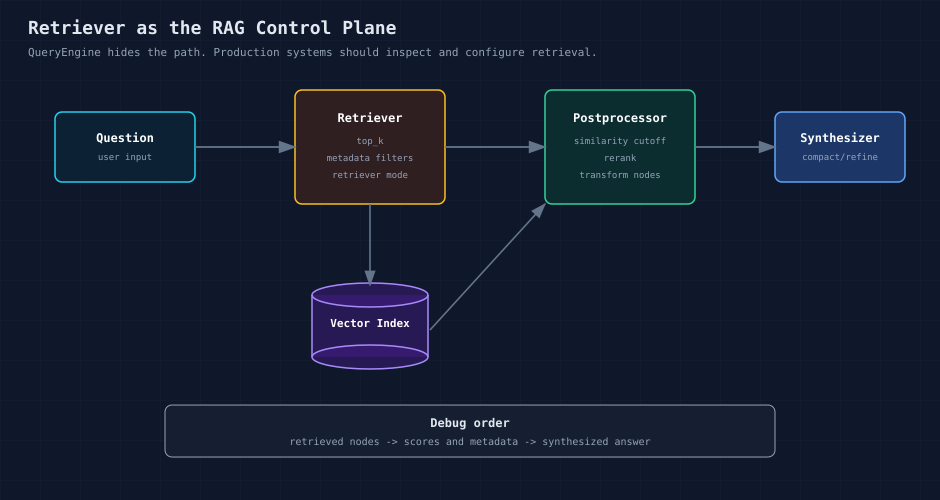
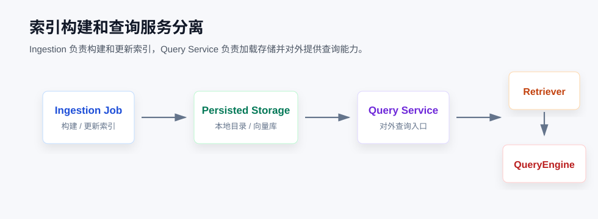

# LlamaIndex（三）：别只会 as_query_engine，RAG 问题要从 Retriever 查起

很多 LlamaIndex 示例都会从 `index.as_query_engine()` 开始。

这个入口很适合入门，但它也容易让人忽略一个事实：RAG 的效果首先取决于检索到了什么，其次才是 LLM 如何组织回答。

我自己调 RAG 时，最怕的一类问题不是程序报错，而是回答看起来挺顺，但细看又和资料对不上。这个时候如果只盯着 Prompt 改，很容易越改越乱。

更实际的排查方式，是先拆开 QueryEngine，看 Retriever 命中了哪些 Node、分数是多少、上下文是否真的支持最终回答。

如果你是第一次看这几个对象，可以先按这个方式区分：

**Index 管数据怎么放，Retriever 管问题来了取哪些数据，QueryEngine 管怎么把检索结果组织成回答。**

这篇接着第二篇往下走。

第二篇我们关心的是“文档怎么变成 Node”。到了这一篇，问题变成了：用户问一句话，系统到底从这些 Node 里拿了哪几段出来。下一篇再继续往上，看同一套查询能力怎么变成单轮问答、多轮对话，或者 Agent 可以调用的工具。

我们从默认 QueryEngine 开始，再一步步把 Retriever、Response Synthesizer、Node Postprocessor 拆出来。

代码会比 `index.as_query_engine()` 多一点，但好处也很直接：出了问题时，知道先看哪一层。

## 01 Index、Retriever、QueryEngine 的边界

`VectorStoreIndex` 负责组织可检索数据。它通常会把 Node 向量化，并写入默认或外部向量存储。

`Retriever` 是查询时的检索接口。它接收用户问题，返回相关 Node。

`QueryEngine` 是更上层的查询入口。它通常会调用 Retriever，再把检索结果交给 Response Synthesizer 和 LLM 生成回答。



这张图里我最关心的不是 QueryEngine，而是 Retriever。

RAG 出问题时，很多时候不是模型突然变差了，而是它一开始拿到的材料就不对。模型只能基于给它的上下文回答，Retriever 这一步如果偏了，后面再调 Prompt，效果也有限。

## 02 为什么不要只依赖默认 QueryEngine

默认方式很简单：

```python
query_engine = index.as_query_engine()
response = query_engine.query("问题")
```

这两行代码没问题，我自己写第一个 Demo 也会这么写。

它的问题在于太省事了。检索怎么做、拿回了哪些 Node、有没有过滤、最后怎么合成回答，全都藏在 QueryEngine 后面。

Demo 阶段这样很好，先跑通再说。

到了项目里，问题会变得具体很多。

用户说答案不对，你不能只回一句“我再调下 Prompt”，你得知道这次召回了哪几段内容。

知识库里有多个部门的资料，你得知道这次有没有越过权限边界。

答案其实在候选结果里，但排得靠后，这时候要看的可能是 rerank，而不是 LLM。

服务重启后还重新建索引，也不是长久办法，索引要能持久化。

回答引用了某段资料，最好能点回原文。出了问题时，至少知道它是从哪段内容推出来的。

这些问题都落在 QueryEngine 背后的链路上。只看最终回答，基本看不出来。

所以这一篇先不追求回答更漂亮，而是把链路拆开看。Retriever 有没有拿到正确资料，排序是否合理，回答合成和 Prompt 有没有问题，这几件事分开看，排查会轻松很多。等到第六篇讲评估时，这个拆法还会继续用。

## 03 示例 1：默认 QueryEngine

第一个示例先不拆，仍然走最短路径。

写 RAG 程序时，我一般也会先这样做。先确认数据能读进来、向量能建出来、模型能返回答案。这个阶段过早拆组件，反而容易把注意力带偏。

**代码位置**

```text
code/03_querying/01_default_query_engine.py
```

**先看代码**

```python
index = build_example_index()
query_engine = index.as_query_engine(similarity_top_k=2)
response = query_engine.query("生产环境的 RAG 系统需要关注哪些问题？")
```

这段代码不长，但里面已经走完了一次最小 RAG。

`build_example_index()` 是我们自己封装的辅助函数，负责读取示例文档并构建 `VectorStoreIndex`。

`as_query_engine()` 会从 Index 创建一个查询入口。它把检索和回答生成都包了进去，所以看起来很短。

`query()` 执行一次查询，返回 `Response`。

这里最容易忽略的是 `response.source_nodes`。调试时不要只看最终回答，顺手把 source nodes 打出来。很多时候不是模型不会答，而是它从一开始就没拿到正确材料。

## 04 示例 2：显式 Retriever

第二个示例开始把 QueryEngine 拆开。

这次先不让模型回答，只看 Retriever 返回了什么。换句话说，先检查模型回答前拿到的材料。

**代码位置**

```text
code/03_querying/02_explicit_retriever.py
```

**先看代码**

```python
retriever = index.as_retriever(similarity_top_k=3)
nodes = retriever.retrieve("RAG 质量下降时应该先排查什么？")
```

`as_retriever()` 从 Index 创建 Retriever。

`retrieve()` 只做检索，不生成回答。

`nodes` 是这次命中的候选上下文。

拿到这些 Node 后，先别急着看模型回答。先看命中的内容是不是相关，是否真的包含回答所需的信息。

如果这里已经错了，后面 Prompt 写得再细也救不回来。

## 05 示例 3：手动组装 QueryEngine

第三个示例把默认 QueryEngine 拆成 Retriever 和 Response Synthesizer。

第一次看会觉得代码变长了。实际项目里，这几行通常省不掉，因为它把后面要调的地方提前暴露出来了。

**代码位置**

```text
code/03_querying/03_custom_query_engine.py
```

**先看代码**

```python
retriever = index.as_retriever(similarity_top_k=2)
response_synthesizer = get_response_synthesizer(response_mode="compact")
query_engine = RetrieverQueryEngine(
    retriever=retriever,
    response_synthesizer=response_synthesizer,
)
```

这段代码做的事情很直接：把默认 QueryEngine 里藏着的 Retriever 和 Response Synthesizer 拿出来。

Retriever 负责取上下文。

Response Synthesizer 负责把取回来的 Node 组织成回答。

`response_mode="compact"` 先不用想得太复杂。它会尽量把上下文整理到一次模型调用里完成回答。入门阶段用这个就可以。等遇到长文档、多段上下文，再去比较 `refine` 等模式。

代码确实比 `index.as_query_engine()` 长了一点，但后面要换 Retriever、加 Node Postprocessor、调 response mode，就不用重写整个查询服务。

## 06 示例 4：Node Postprocessor

第四个示例加上 Node Postprocessor。

它的位置在“检索之后、生成之前”，适合做过滤、重排和上下文整理。

**代码位置**

```text
code/03_querying/04_node_postprocessor.py
```

**先看代码**

```python
retrieved_nodes = retriever.retrieve(question)

processor = SimilarityPostprocessor(similarity_cutoff=0.5)
filtered_nodes = processor.postprocess_nodes(retrieved_nodes, query_str=question)
```

`SimilarityPostprocessor` 是一个 Node 后处理器。

它的位置在 Retriever 之后、生成回答之前。

流程上是 Retriever 先把候选 Node 找出来，Postprocessor 再决定哪些 Node 留下、哪些丢掉。

这里的 `similarity_cutoff=0.5` 只是示例参数，不是通用标准。真实项目里要用固定问题集去调。

实际做 RAG 时，经常会先多召回一点，再在生成前做一轮过滤或重排。相似度过滤、rerank、按时间衰减、按业务规则过滤，都可以放在这个位置。

## 07 示例 5：持久化索引并重新加载

第五个示例进入更接近服务化的场景。

Demo 可以每次启动都重新建索引，但真实服务通常不会这样做。

**代码位置**

```text
code/03_querying/05_persist_and_reload.py
```

**先看代码**

```python
index.storage_context.persist(persist_dir=str(persist_dir))

storage_context = StorageContext.from_defaults(persist_dir=str(persist_dir))
loaded_index = load_index_from_storage(storage_context)
```

这段代码里有三个和存储相关的动作。

`storage_context.persist()` 把索引相关数据保存到本地目录。

`StorageContext.from_defaults()` 从持久化目录恢复存储上下文。

`load_index_from_storage()` 再从这个存储上下文里把索引加载回来。

Demo 里每次启动都重新构建索引问题不大。真实服务不能这样做。

生产系统通常会把 ingestion 和 query service 分开：



索引构建任务负责把数据写进去，查询服务只负责加载和查询。

这样拆开以后，服务启动时不需要重新跑一遍 ingestion。后面文档更新，也可以单独跑索引任务，不用动查询服务。

## 08 similarity_top_k 怎么选

`similarity_top_k` 控制每次取回多少个候选 Node。

这个参数很容易被当成“效果不好就调大一点”。但它不是越大越好。

`top_k` 太小，关键上下文可能拿不到；`top_k` 太大，又会把不少无关内容塞进上下文里，token 成本也会上去。更麻烦的是，资料一多，模型反而可能抓不住重点。

我一般不会凭感觉调这个参数。准备一组固定问题，分别跑 `top_k=2`、`top_k=3`、`top_k=5`，看命中的 Node 是否相关，关键答案有没有被召回，最终回答有没有忠实于上下文，再看成本能不能接受。

## 09 什么时候需要更复杂的 Retriever

最小 RAG 通常从向量相似度检索开始。

这条路能覆盖很多入门场景，但项目往前走以后，问题会变得更具体。

如果系统里有租户、权限、时间、文档类型，就需要 metadata filter。否则 Retriever 可能会把用户本来不该看到的资料也召回来。

如果用户经常问产品编号、报错码、专有名词，只靠向量相似度可能会漏。这个时候可以考虑 hybrid search 或 fusion retriever，把关键词检索也纳入召回。

如果答案已经在候选结果里，但排得比较靠后，就不是“有没有召回”的问题，而是排序问题。这里可以考虑 rerank。

如果不同问题本来就应该查不同索引，比如一类问题查产品文档，另一类问题查代码说明，那就可以考虑 Router Retriever。

如果文档是层级结构，或者 chunk 切得比较细，但回答又需要更完整的上下文，可以继续看 Recursive Retriever 或 Auto Merging Retriever。

这里不要一上来就把所有策略都堆上去。每加一个策略，都应该能说清楚它解决了什么问题，并且能通过评估看到效果变化。

所以这一篇不是只讲 `similarity_top_k`。`top_k` 是最容易动的参数，但 Retriever 真正要解决的是“查询时的上下文控制”。

GraphRAG、Text-to-SQL、LlamaParse、多模态 RAG 这些能力也很重要，但我不会放在这一篇展开。它们已经不是普通文档检索里的一个参数，而是新的专题。

第三篇先把普通 RAG 的检索控制面讲清楚。后面如果继续写进阶篇，再单独拆这些能力。

## 10 写成服务时怎么放

生产系统中，建议把 Retriever 当成独立配置和独立评估对象。

我更倾向于把它拆成几个清楚的角色：

```text
IndexBuilder
  -> 负责构建和更新索引

RetrieverFactory
  -> 根据业务场景创建不同 Retriever

QueryService
  -> 调用 Retriever 和 QueryEngine，对外提供稳定接口

EvaluationJob
  -> 固定问题集评估检索和回答质量
```

这样检索策略变化不会影响数据接入层，业务接口也不用知道底层使用了哪个向量库或 reranker。

## 11 本期小结

`VectorStoreIndex` 解决的是“如何组织可检索数据”。`Retriever` 解决的是“查询时取哪些上下文”。`QueryEngine` 解决的是“如何基于上下文生成回答”。

入门时可以直接使用：

```python
index.as_query_engine()
```

进入真实项目后，要尽早拆开 Retriever，并把检索结果打印、记录和评估起来。RAG 的很多问题，答案都在 source nodes 里。

## 参考资料

- Query Engine 文档：https://developers.llamaindex.ai/python/framework/module_guides/deploying/query_engine/
- Node Postprocessor 文档：https://developers.llamaindex.ai/python/framework/module_guides/querying/node_postprocessors/
- Persisting & Loading Data 文档：https://developers.llamaindex.ai/python/framework/module_guides/storing/save_load/
