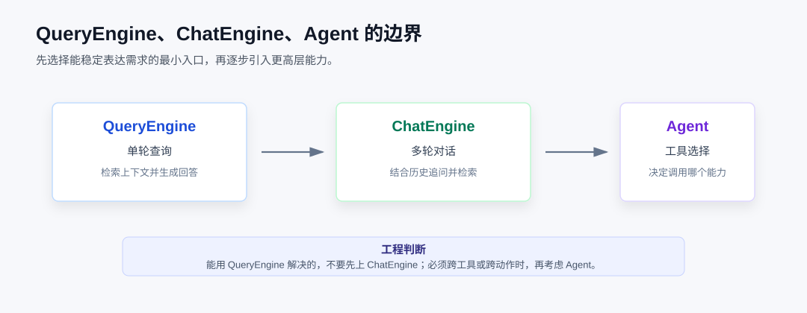

# LlamaIndex（四）：从问答到 Agent，LlamaIndex 的三个入口怎么选

学到这里，很多人会自然问一个问题：LlamaIndex 里有 QueryEngine、ChatEngine，还有 Agent，它们看起来都能回答问题，到底该用哪个？

这个问题不是概念题，写代码时很快就会遇到。

很多 RAG 项目变复杂，不是因为业务一开始就复杂，而是因为入口选得太重。明明只是问一份文档里的内容，却先上 Agent；明明只是单轮问答，却把多轮对话状态也带进来。代码看起来能力更多了，排查时也更费劲。

这一篇我们先把边界讲清楚。



这三个入口的边界其实不复杂：

QueryEngine 处理单轮查询。

ChatEngine 处理连续追问。

Agent 处理工具选择和外部动作。

先别急着把 Agent 放到最前面。

这一篇接的是第三篇。

第三篇我们把 `Retriever` 和 `QueryEngine` 拆开，是为了控制检索质量。这一篇往上走一层，看同一套查询能力怎样变成不同产品入口。下一篇再继续往上，把“多步查询、分支、校验、重试”放进 Workflow。

## 01 三个入口怎么选

**QueryEngine**

QueryEngine 放在明确的单轮问题上最省心。

比如：

“LlamaIndex 在 RAG 系统里负责什么？”

这类问题不需要记住前文，也不需要选择多个工具，只需要从索引里检索相关上下文，然后组织回答。

**ChatEngine**

ChatEngine 更适合围绕同一批资料连续追问。

比如：

第一轮问：“RAG 系统生产化要先看什么？”

第二轮接着问：“把刚才的回答整理成三点。”

这里第二个问题依赖前一轮上下文，所以比 QueryEngine 多了一层对话状态。

**Agent**

Agent 留给需要工具选择、任务拆解、外部动作的场景。

比如一个 Agent 同时有几个工具：

- 查询 LlamaIndex 教程笔记；
- 查询项目代码；
- 调用一个业务 API；
- 生成一份检查清单。

这时用户的问题不一定只对应一个检索动作，Agent 才有必要判断该调用哪个工具，甚至按步骤调用多个工具。

这里可以用一个很朴素的判断。

用户问一个明确问题，只需要查资料回答，就用 QueryEngine。

用户围绕同一批资料连续追问，再用 ChatEngine。

用户的问题需要在多个工具之间选择，或者要执行外部动作，再考虑 Agent。

如果流程本来就很明确，只是步骤比较多，那其实更接近下一篇要讲的 Workflow。

Agent 和 Workflow 不是同一个层级的东西。Agent 偏“让模型决定调用哪个工具”，Workflow 偏“开发者把流程顺序写清楚”。这个边界不先讲清楚，后面做复杂 RAG 时，很多逻辑都会被塞进 Agent。

## 02 为什么不要过早上 Agent

Agent 能力更强，但它不应该默认出场。

Agent 会带来新的复杂度：

- 工具描述要写清楚；
- 工具输入输出要稳定；
- 失败路径要能恢复；
- 调试时要看每次工具调用；
- 评估时不能只看最终回答。

如果一个需求用 QueryEngine 就能稳定解决，那就先用 QueryEngine。

如果只是围绕同一批资料多轮追问，再考虑 ChatEngine。

只有当系统真的需要“选择工具”或“执行动作”时，再把 Agent 引进来。

## 03 示例1：用 QueryEngine 做单轮查询

**代码位置**

```text
code/04_engines_agents/01_query_engine.py
```

这个示例仍然走最简单的路线：

```python
index = build_example_index()
query_engine = index.as_query_engine(similarity_top_k=2)
response = query_engine.query("LlamaIndex 在 RAG 系统中主要负责什么？")
```

如果需求只是“根据资料回答一个问题”，这就是最清晰的入口。

跑完以后，重点看两件事：

- 回答是否来自资料；
- `source_nodes` 是否能解释这个回答。

## 04 示例2：用 ChatEngine 做连续追问

**代码位置**

```text
code/04_engines_agents/02_chat_engine.py
```

代码是这样：

```python
chat_engine = index.as_chat_engine(
    chat_mode="condense_question",
    similarity_top_k=2,
)

print(chat_engine.chat("RAG 系统生产化要先看什么？"))
print(chat_engine.chat("把刚才的回答整理成三点。"))
```

这段代码里主要看 `chat_mode="condense_question"`。

用户连续追问时，当前问题经常是不完整的。比如第二句只说“整理成三点”，它本身并不知道要整理什么。

`condense_question` 做的事，就是把当前问题和历史对话合在一起，先变成一个更完整的问题，再去检索。

它适合文档助手、知识库问答里的连续追问。

## 05 示例3：把 QueryEngine 包装成 Tool

**代码位置**

```text
code/04_engines_agents/03_query_engine_tool.py
```

Agent 不是直接“知道所有资料”。它通常通过工具访问能力。

在 LlamaIndex 里，可以把 QueryEngine 包装成 Tool：

```python
tool = QueryEngineTool(
    query_engine=query_engine,
    metadata=ToolMetadata(
        name="llamaindex_rag_notes",
        description="查询 LlamaIndex、RAG 数据链路和生产化注意事项。",
    ),
)
```

这里出现两个新对象。

`QueryEngineTool` 负责把 QueryEngine 包装成 Agent 可以调用的工具。

`ToolMetadata` 负责告诉 Agent 这个工具叫什么、适合干什么。

这里的 `name` 和 `description` 最好认真写。

Agent 会根据工具描述判断什么时候调用它。如果描述含糊，Agent 的工具选择也会变得不稳定。

真实项目里，一个 Agent 往往不会只有一个工具。

例如：

```text
llamaindex_docs_tool   -> 查询 LlamaIndex 教程
project_code_tool      -> 查询当前项目代码
ticket_search_tool     -> 查询需求或故障单
write_report_tool      -> 生成检查报告
```

这时工具设计往往比 Agent 本身更关键。工具要小而清楚，每个工具都应该有稳定的职责边界。把“查资料、改数据、发通知、生成报告”全塞进一个工具描述里，后面基本不好调。

一个比较好维护的工具说明，至少要把三件事写清楚。

第一，工具名要稳定，别今天叫 `rag_tool`，明天又叫 `search_tool`。

第二，描述要具体，最好写清楚适合回答什么问题，不适合处理什么问题。

第三，输出要能被后续步骤继续使用。Agent 调完工具之后，返回结果如果只是一段含糊文本，后面就很难继续推理。

## 06 示例4：让 FunctionAgent 调用工具

**代码位置**

```text
code/04_engines_agents/04_function_agent.py
```

当前版本的 LlamaIndex 推荐使用 `FunctionAgent / AgentWorkflow` 这套 Agent 体系。我们这里先用单 Agent：

```python
agent = FunctionAgent(
    name="llamaindex_helper",
    tools=[rag_tool],
    llm=Settings.llm,
    system_prompt="你是 LlamaIndex 教程助手。需要查资料时先调用工具，再基于工具结果回答。",
)

response = await agent.run(user_msg="Retriever 和 QueryEngine 的区别是什么？")
```

这段里最值得注意的是 `tools=[rag_tool]`。

Agent 不是凭空知道知识库内容，它只能通过工具访问外部能力。这里给它一个 `rag_tool`，它才有机会去查我们前面构建的 QueryEngine。

`llm=Settings.llm` 继续沿用 `common.py` 里的模型配置。

`agent.run()` 是一次异步任务执行。

这个实验不追求让 Agent 显得多聪明，重点放在 Agent 和 Tool 的关系上。

QueryEngine 是可控的检索问答能力。

Tool 是 Agent 可以调用的能力。

Agent 负责决定什么时候调用哪个 Tool。

到这里，第三篇和第四篇就接上了：

```text
Retriever -> QueryEngine -> Tool -> Agent
```

如果底下的 Retriever 不稳定，Agent 只会把不稳定放大。所以做 Agent 之前，先把 QueryEngine 当成一个可靠工具打磨好。

## 07 多工具 Agent 要先设计工具边界

很多人第一次写 Agent，会把重点放在 Agent 本身。

但影响稳定性的，往往是工具。

比如你想做一个“项目知识助手”，它可能有这些能力：

```text
query_docs_tool       -> 查询产品文档
query_code_tool       -> 查询代码说明
query_ticket_tool     -> 查询需求和故障单
create_summary_tool   -> 生成总结
```

这些工具看起来都能“查资料”，但边界不能混。

如果一个工具既查文档、又查代码、又改状态，Agent 很难判断什么时候该用它。后面排查问题时，你也很难知道是工具选错了，还是工具内部逻辑错了。

我会优先检查几件事。

一个 Tool 只解决一种清楚的问题。

`description` 要写清楚适用场景和不适用场景。

工具返回结果要能被 Agent 继续使用。

查不到、权限不足、参数错误，都要有明确返回。

最好让 Tool 脱离 Agent 也能单独测试。

这和第三篇的 `QueryEngine` 是接在一起的。

一个 `QueryEngine` 可以包装成一个 `Tool`。多个索引、多个数据源、多个业务能力，也可以分别包装成多个 Tool。Agent 要做的，是在这些稳定工具之间做选择，而不是帮每个工具兜底。

## 08 Agent Memory 要和 ChatEngine 区分开

第四篇里我们用了 `ChatEngine` 做连续追问。

这里要补一个容易混淆的点：**多轮对话历史不等于长期记忆。**

ChatEngine 更像是当前会话里的上下文管理。它关心的是“用户刚才说了什么，现在这句追问怎么改写成完整问题”。

Agent Memory 更偏长期状态。它可能记录：

- 用户偏好；
- 已经完成的任务；
- 反复出现的问题；
- 工具调用结果；
- 某些需要跨会话保留的信息。

这类记忆不能随便塞进 prompt。它需要考虑生命周期、可删除性、权限边界和污染问题。否则系统跑一段时间后，记忆本身就会变成新的噪声来源。

入门阶段不用急着把 Memory 引进来。

同一次会话里的连续追问，先用 ChatEngine。

Agent 执行过程里的短期状态，可以放在 Workflow 或 Agent runtime state 里。

需要跨会话保存用户偏好时，再认真设计 Memory。

业务事实不要放进记忆里，应该通过 Tool 或 QueryEngine 去查。

所以本篇只点到 Memory 的边界，不展开长期记忆实现。长期记忆适合后面单独写一篇，因为它已经不只是 LlamaIndex API 问题，还涉及数据治理。

## 09 做项目时，先从简单入口开始

落到项目里，我会先从最简单的入口开始。

能用 QueryEngine 稳定回答的问题，就先停在 QueryEngine。

如果用户确实需要围绕同一批资料连续追问，再上 ChatEngine。

只有跨工具、跨数据源、跨动作时，Agent 才值得加入。

这不是保守，主要是为了让系统更容易调试。

Agent 适合放在更高一层。底下的 QueryEngine、Retriever、Tool 都应该先稳定，否则 Agent 只是在不稳定能力之上再加一层不确定性。

还有一个常见误区：Agent 不是流程治理工具。

如果你的流程已经很明确，比如：

```text
问题改写 -> 检索 -> 相关性判断 -> 二次检索 -> 生成回答 -> 评估记录
```

这类场景更适合下一篇要讲的 Workflow。你可以在 Workflow 的某个 step 里放 Agent，但不要把整个流程都交给 Agent 自由发挥。

## 10 收个尾

这一篇其实就想说明一件事：入口不要选重。

LlamaIndex 允许你把 RAG 查询能力包装成 Tool，再交给 Agent 使用。但顺序最好别反过来。

先把检索和查询做好，再谈 Agent。

## 参考资料

- Agents 官方介绍：https://docs.llamaindex.ai/en/stable/understanding/agent/
- FunctionAgent / AgentWorkflow 示例：https://docs.llamaindex.ai/en/stable/examples/agent/agent_workflow_basic/
- QueryEngine Tool 文档：https://docs.llamaindex.ai/en/stable/module_guides/deploying/agents/tools/
