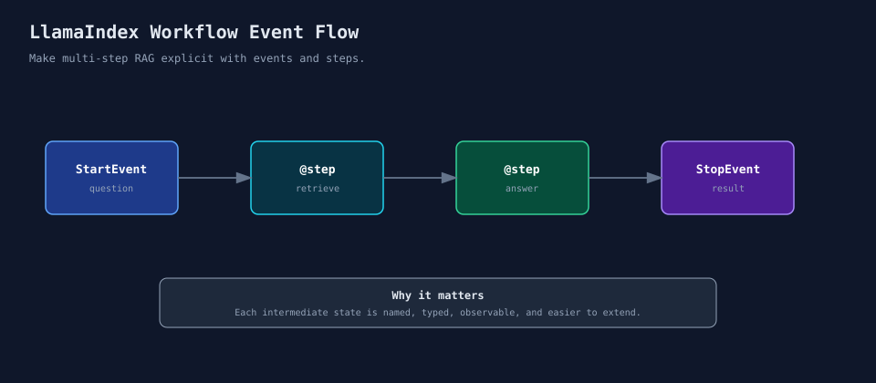

# LlamaIndex（五）：当 RAG 不再是一问一答，就该看 Workflows 了

前面几篇里，我们已经把数据接入、索引、检索、QueryEngine、ChatEngine、Agent 都看了一遍。

但真实项目里，RAG 很少一直停留在“检索后回答”这一步。

你很快会遇到更长的流程：

- 先判断问题是否清楚；
- 不清楚时先改写问题；
- 检索相关上下文；
- 检查上下文是否足够；
- 不够时扩大检索范围；
- 再生成回答；
- 回答后还要做校验或记录。

这些逻辑一开始都能写在一个函数里。问题是改到第三四轮以后，这个函数会越来越像一团流程判断，新增一个分支都要重新读半天。

LlamaIndex Workflows 解决的就是这个问题：**把多步骤 LLM 应用显式编排出来。**



这篇接住第四篇留下的问题。

第四篇讲 Agent 时，我一直在强调：别把所有复杂度都丢给 Agent。很多流程并不需要模型自由决定下一步，开发者其实知道先做什么、后做什么，只是步骤变多了，需要一个清楚的流程结构。

这类场景才是 Workflow 比较舒服的位置。

## 01 Workflow 解决的不是“能不能串起来”

用普通 Python 函数当然也能串步骤。

但问题是，当步骤变多以后，你需要回答几个问题：

- 当前执行到哪一步；
- 每一步输入输出是什么；
- 哪些步骤可以分支；
- 哪些步骤可以重试；
- 中间状态怎么观察；
- 后面要加人工确认或评估反馈时，插在哪里。

到这一步，Workflow 的价值才会变得明显。

它不是为了替代函数，而是让复杂流程有明确的事件和步骤边界。

在 RAG 系统里，Workflow 通常不是单独出现的。它会把前几篇的组件重新组织起来：

```text
第 2 篇：Ingestion 产出 Node
第 3 篇：Retriever 负责取上下文
第 4 篇：QueryEngine / Tool / Agent 提供能力入口
第 5 篇：Workflow 把这些能力按步骤编排
```

所以 Workflow 不是另起一套系统，而是把已有组件放到更清楚的位置上。

## 02 先理解四个概念

这里先认四个名字，不需要一开始就背 API。

`Workflow` 是流程本身。

`Event` 是步骤之间传递的数据。

`StartEvent` 是入口，`StopEvent` 是出口。

`@step` 用来标记一个步骤。LlamaIndex 会根据 step 的输入输出类型，把流程串起来。

## 03 实验 1：最小 Workflow

**代码位置**

```text
code/05_workflows/01_basic_workflow.py
```

代码是这样：

```python
class BasicWorkflow(Workflow):
    @step
    async def run_step(self, ev: StartEvent) -> StopEvent:
        topic = ev.topic
        return StopEvent(result=f"收到任务：{topic}")
```

这个例子没有 RAG，是故意这么写的。先把 Workflow 的最小形态看清楚，后面再把检索和回答放进去。

你传入一个 `StartEvent`，step 处理它，然后返回 `StopEvent`。

## 04 实验 2：把 RAG 拆成多个 step

**代码位置**

```text
code/05_workflows/02_multi_step_rag_workflow.py
```

这个实验把 RAG 拆成三步：

```text
StartEvent -> retrieve -> answer -> finish -> StopEvent
```

其中 `retrieve` 返回 `RetrievedEvent`：

```python
class RetrievedEvent(Event):
    question: str
    context: str
```

`RetrievedEvent` 是我们自己定义的事件。

它的作用是把“检索完成后的中间状态”显式传给下一步，而不是藏在某个函数内部。

这一步的意义是：检索结果不再藏在 QueryEngine 里，而是成为流程里的一个显式状态。

后面你要在检索之后加 rerank、相关性判断、上下文压缩，就有位置可以插。

如果把这个例子继续往项目里推，通常会加几步。

检索前可能要先改写问题。

检索后可能要做 rerank、过滤或上下文压缩。

回答生成之后，还可能要记录 source nodes、评分和耗时。

这也是为什么我建议先学 Retriever，再看 Agent 和 Workflow。组件边界清楚以后，流程编排才不会变成一大段难维护的异步代码。

## 05 实验 3：加入一个简单分支

**代码位置**

```text
code/05_workflows/03_branching_workflow.py
```

这个实验做了一个很小的分支：

如果问题太短，先改写问题；

如果问题足够清楚，直接回答。

```python
if len(question) < 8:
    return NeedRewriteEvent(question=question)
return ReadyToAnswerEvent(question=question)
```

这里的 `NeedRewriteEvent` 和 `ReadyToAnswerEvent` 都是自定义事件。

Workflow 会根据 step 返回的事件类型，决定下一步该走哪条路径。

这只是一个简化例子，真实项目不会用问题长度来判断清不清楚。

真实系统里，这一步可以换成 LLM 判断，也可以接入规则、分类器或意图识别模型。

这个规则本身不重要，重要的是分支被放进了清楚的事件流里。

真实项目里的分支通常更细。

问题不完整时，可能要先改写，或者向用户追问。

检索结果为空时，可能要扩大 `top_k`，换 Retriever，或者直接返回“资料不足”。

检索结果相关性低时，可能要触发二次检索或关键词检索。

如果涉及创建工单、发送通知这类外部动作，就要交给 Agent 或业务工具处理。

这些分支如果全部写在一个 `query()` 函数里，短期能跑，后期很难排查。Workflow 至少能让每个分支有名字、有输入输出、有日志位置。

## 06 Workflow 和 Agent 的关系

很多人会把 Workflow 和 Agent 混在一起。

它们确实有关系，但别混成一回事。

Agent 更关注“让模型根据工具和上下文决定下一步”。

Workflow 更关注“开发者把流程步骤和状态边界显式定义出来”。

在 LlamaIndex 里，`AgentWorkflow` 也是建立在 Workflows 之上的。Agent 可以运行在 Workflow 里，Workflow 也可以编排多个 Agent 或多个 RAG 步骤。

如果流程本来就很明确，先用 Workflow。

如果你的流程需要模型动态决定工具和路径，再考虑 Agent。

更实际的组合方式是：

```text
Workflow 管流程骨架
Agent 管某个 step 内的工具选择
QueryEngine 管稳定的知识库查询
Retriever 管检索质量
```

比如一个售后知识库助手，可以用 Workflow 先判断问题类型，再决定是否进入 RAG 检索；如果用户要求生成工单，再在某个 step 里调用 Agent，让 Agent 在“查用户信息、查订单、创建工单”几个工具里选择。

这样设计的好处是，核心流程由工程代码控制，局部不确定性才交给 Agent。

## 07 Workflow 进阶能力放在哪里

前面的示例只写了最小 Workflow、多 step 和简单分支。

真实项目里，Workflow 往往还会继续长出几类能力。

查询改写一般放在检索前。

二次检索放在检索结果不足或相关性低之后。

Rerank 和上下文压缩放在检索之后、回答之前。

人工确认放在执行外部动作之前。

评估和日志放在回答生成之后。

Agent 可以放在某个需要动态工具选择的 step 里。

Workflow 的价值不是“多写几个 step”，而是让每个复杂动作都有明确位置。

举个更接近生产的 RAG 流程：

```text
StartEvent
  -> classify_question
  -> rewrite_question
  -> retrieve
  -> judge_context
  -> rerank_or_expand
  -> answer
  -> evaluate
  -> log_result
  -> StopEvent
```

这里我会特别留意 `judge_context` 这一步。

如果检索结果足够好，就进入回答。

如果检索结果不够好，可以扩大 `top_k`，换成混合检索，或者返回“资料不足”。这比让 LLM 硬答更可控。

人工确认也可以放在 Workflow 里。

比如用户要求“根据知识库结论创建工单”，查询知识库可以自动完成，但创建工单属于外部动作，最好在动作前停一下，让用户确认内容。这个位置如果只靠 Agent 自己决定，线上风险会更高。

## 08 什么时候该用 Workflow

我不会因为“流程超过 3 个步骤”就立刻上 Workflow。

更实际的判断是：这个流程有没有清楚的中间状态，是否需要分支、重试、人工确认，后面是否要记录每一步的结果。

如果只是一次普通查询，QueryEngine 就够了。

不需要为了抽象而抽象。

反过来，如果你已经开始在一个函数里维护很多 `if/else`、重试、日志和中间变量，就说明可以考虑 Workflow 了。这个信号比“流程有几个步骤”更可靠。

## 09 收个尾

Workflow 不是为了把函数换一种写法串起来。

它有价值的地方，是让每一步的输入输出、中间状态和分支路径变得明确。

这一篇先把这条线跑通：

```text
StartEvent -> Event -> @step -> Event -> StopEvent
```

当 RAG 开始出现多步骤、多分支、多状态时，Workflow 会比单个函数更容易维护。

## 参考资料

- Workflows 基础文档：https://docs.llamaindex.ai/en/stable/understanding/workflows/basic_flow/
- Workflows API 文档：https://docs.llamaindex.ai/en/stable/api_reference/workflow/workflow/
- AgentWorkflow 示例：https://docs.llamaindex.ai/en/stable/examples/agent/agent_workflow_basic/
