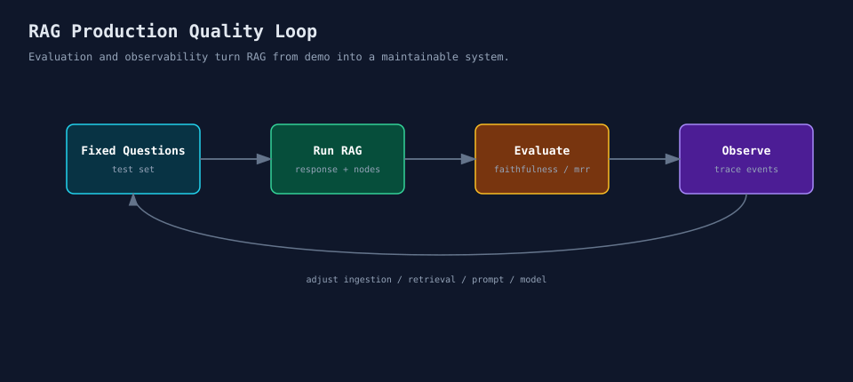

# LlamaIndex（六）：RAG 上线前，先把评估和观测补上

RAG Demo 跑通以后，经常会产生一种错觉：只要能回答问题，就差不多可以上线了。

做项目时，麻烦的往往不是“代码跑不起来”，而是回答看起来合理，但你不知道它到底对不对。

它检索到了正确上下文吗？

回答有没有忠实于上下文？

这次回答用了哪些 Node？

改了切分参数以后，效果是变好了还是变差了？

换了 Embedding 模型以后，检索质量有没有变化？

这些问题如果没有评估和观测，只能靠人工感觉。

这一篇收一下尾：怎么让 LlamaIndex RAG 从 Demo 走向可维护系统。



这篇不是突然切到“上线 checklist”。

它其实是在回看前五篇：

```text
数据切得是否合适 -> 检索是否命中 -> 回答是否忠实 -> Agent 是否调对工具 -> Workflow 每一步是否可追踪
```

前面每一层都会影响最终回答。第六篇要解决的问题是：当最终效果不好时，我们怎么知道问题出在哪一层。

## 01 生产化不是多写几个接口

很多人一说生产化，会先想到 FastAPI、Docker、数据库、鉴权。

这些当然重要。

但对 RAG 来说，还有一类更核心的问题：质量是否可追踪。

一个可维护的 RAG 系统，不能只保存最终回答。

输入问题是什么，检索到了哪些 Node，每个 Node 的分数是多少，最后回答了什么，这些都要能查到。

如果后面改了 chunk、Embedding、top_k 或 Prompt，也要能对比改动前后的效果。

没有这些信息，线上问题基本只能靠猜。

我更习惯把问题拆成几层看。

第一层看 ingestion。文档有没有解析完整，chunk 是否合理，metadata 能不能支持过滤。

第二层看 retrieval。Retriever 有没有命中正确 Node，排序是否合理，权限过滤有没有生效。

然后看 generation。回答是否忠实于上下文，是否真的回答了用户问题。

如果用了 Agent 或 Workflow，还要看工具有没有调对，流程有没有走错分支。

这样拆开以后，问题就不会被笼统归因成“模型不行”。很多时候问题在更前面，比如切块不合适、metadata 缺失，或者 Retriever 根本没命中该命中的内容。

## 02 示例1：固定问题集

**代码位置**

```text
code/06_production/01_fixed_question_set.py
```

先从最简单但很有效的方式开始：固定问题集。

```python
QUESTIONS = [
    "LlamaIndex 在 RAG 系统里负责什么？",
    "为什么 ingestion 要单独设计？",
    "Retriever 和 QueryEngine 的区别是什么？",
]
```

每次你改切分、Embedding、top_k、Prompt、模型时，都用同一组问题跑一遍。

这件事看起来简单，但很有用。

因为它能让你从“感觉变好了”变成“有一组固定样本可以对比”。

问题集别只写“正常问题”。

要有文档里明确有答案的问题，也要有文档只部分覆盖的问题。

还要放一些无答案问题，看看系统会不会硬答。

如果你的知识库有权限、租户、文档类型这些边界，也要专门准备问题去测。

如果第四篇用了 ChatEngine，第五篇用了 Workflow，多轮追问和流程分支也应该进入问题集。

## 03 示例2：Response Evaluation

**代码位置**

```text
code/06_production/02_response_evaluation.py
```

这一段使用两个 Evaluator：

```python
faithfulness = FaithfulnessEvaluator(llm=Settings.llm)
relevancy = RelevancyEvaluator(llm=Settings.llm)
```

这里两个 Evaluator 的职责不同：

- `FaithfulnessEvaluator`：检查回答是否忠实于检索到的上下文。
- `RelevancyEvaluator`：检查回答是否和用户问题相关。
- `Settings.llm`：评估本身也需要 LLM 判断，这里复用统一配置的模型。

这里不用把指标想得太复杂。

Faithfulness 看回答有没有忠实于检索上下文。

Relevancy 看回答和用户问题是否相关。

这类评估不是为了替代人工判断，而是为了在反复改参数时提供一个稳定参考。

尤其是 RAG 系统迭代时，不能每次只挑几个顺眼的问题人工看一眼。

## 04 示例3：Retrieval Evaluation

**代码位置**

```text
code/06_production/03_retrieval_evaluation.py
```

RAG 要拆开看。

回答质量不好，不一定是模型问题，也可能是检索没命中。

LlamaIndex 提供了 `RetrieverEvaluator`，可以用 `hit_rate`、`mrr` 等指标看检索器表现。

```python
evaluator = RetrieverEvaluator.from_metric_names(
    ["hit_rate", "mrr"],
    retriever=retriever,
)
```

这里先记住一件事：`RetrieverEvaluator` 评估的是 Retriever，不是最终回答。

`hit_rate` 看有没有命中期望文档或节点。

`mrr` 会进一步看命中的结果排得靠不靠前。

这里先不纠结某个指标本身，先养成一个习惯：

**先评估检索，再评估回答。**

如果检索上下文都不对，回答再流畅也没用。

这和第三篇是直接关联的。

第三篇让我们显式查看 `source_nodes`，第六篇则把这件事固定成评估任务。调试时人工看 source nodes，迭代时用 retrieval evaluation 做批量对比。

## 05 示例4：Tracing 和调试事件

**代码位置**

```text
code/06_production/04_trace_callback.py
```

这一段用 `LlamaDebugHandler` 看一次查询内部发生了什么：

```python
debug_handler = LlamaDebugHandler(print_trace_on_end=True)
Settings.callback_manager = CallbackManager([debug_handler])
```

这里涉及 LlamaIndex 的 callback 机制：

- `LlamaDebugHandler`：本地调试用的 handler，可以打印一次查询过程中的内部事件。
- `CallbackManager`：统一管理 callback handler。
- `Settings.callback_manager`：把调试 handler 挂到全局配置上，让后续查询能记录事件。

这更像本地调试工具。

真实生产环境里，可以接 OpenTelemetry、Phoenix、MLflow 等观测工具，把 LLM、Embedding、Retriever、QueryEngine、Agent、Workflow 的调用链路记录下来。

调试 RAG 时，别只问“模型为什么这么答”。

更应该把问题拆开：

- 它看到的问题是什么；
- 它检索到了什么；
- 它把哪些上下文发给了模型；
- 模型返回了什么；
- 每一步有没有异常或延迟。

如果第五篇用了 Workflow，tracing 还要继续往 step 级别拆。

一次请求从开始到结束，最好能串起来看：原始问题是什么，Retriever 用了什么参数，命中了哪些 Node，Agent 调了哪个工具，Workflow 走了哪个 step，最后评估结果是什么。

这些记录不一定一开始全部做满，但字段设计要尽早想清楚。后面一旦上线，缺日志比代码 bug 更难补。

## 06 Instrumentation 和本地 Debug 不是一回事

前面的 `LlamaDebugHandler` 更像本地开发工具。

它能帮你看到一次查询内部发生了什么，但它不是完整的线上观测方案。

生产环境里，更应该关注 instrumentation。简单说，就是把 LLM、Embedding、Retriever、QueryEngine、Agent、Workflow 的调用过程变成可采集、可查询、可关联的事件。

本地调试时，`LlamaDebugHandler` 已经够用。

如果只是想做一点轻量埋点，可以从 callback 开始，记录事件、耗时、输入输出。

到了线上，就要考虑 OpenTelemetry 这类方案，把 trace 和 span 串起来。Phoenix、MLflow 这类工具更偏评估和可视化，适合看样本、对比实验、分析失败案例。

别等系统上线后才补观测。

从一开始就给每次请求生成 `request_id`。原始问题、检索参数、source nodes、模型名称、token 使用、最终回答、评估结果、错误信息，能记录多少就先记录多少。

这些字段后面会直接影响问题排查效率。

## 07 LlamaDatasets 和固定问题集的关系

第二个容易被忽略的点，是评估数据的管理。

前面我们说先准备固定问题集，这是最轻量的做法。

但项目继续往前走后，你会发现问题集本身也需要管理。比如：

- 哪些问题来自真实用户；
- 哪些问题是边界场景；
- 哪些问题专门用来测权限过滤；
- 哪些问题用来测多轮对话；
- 哪些问题用来测工具调用和 Workflow 分支。

这时就可以关注 LlamaIndex 的 LlamaDatasets，或者用你们团队自己的方式管理评估数据。

固定问题集对入门和小团队已经够用。

LlamaDatasets 更偏数据资产管理，可以把评估样本、期望结果、评估指标组织起来复用。

这件事可以分阶段做。

Demo 阶段，手写 5 到 20 个固定问题就够了。

内测阶段，把真实失败案例收集起来，加入回归问题集。

生产阶段，再按场景维护数据集和固定指标。

后面每次改 chunk、retriever、prompt、model，都跑一遍对比。

评估不是为了追求一个好看的分数，而是为了避免每次改动都靠感觉判断。

## 08 组件要能替换

评估和观测之外，还有一个生产化问题：组件要能替换。

比如 LLM、Embedding 模型、向量数据库、Retriever 策略、chunk 参数、reranker、评估指标，这些后面都有可能换。

如果这些初始化逻辑散落在业务代码里，后面会很难改。

所以最好把它们集中到类似 `common.py` 或更正式的基础设施模块里。

业务层最好只面对稳定接口，比如：

```text
query_service.ask(question)
retriever.retrieve(question)
evaluation_job.run()
```

业务代码不要到处知道底层用了哪个模型、哪个向量库、哪个 embedding 服务。

和前几篇放在一起看，一个更清楚的分层是：

```text
IngestionJob
  -> 读取文档、切块、写入索引

RetrieverService
  -> 根据业务场景创建 Retriever，并暴露检索结果

QueryService
  -> 调用 QueryEngine 或 Synthesizer 生成回答

AgentService
  -> 管理工具列表和工具调用边界

WorkflowService
  -> 编排多步骤任务和分支

EvaluationJob
  -> 固定问题集、检索评估、回答评估、回归对比
```

这不是要求教程代码现在就拆成这么多文件。教程代码保持小而清楚就好。这里的价值是让读者知道：Demo 里的几行代码，到了项目里应该长在哪些位置。

还有一个实际经验：配置和业务代码要分开。

LLM provider、model name、Embedding 模型、向量库连接信息、Retriever 策略、`top_k`、rerank 参数、chunk 参数、评估指标、tracing 开关，这些都不应该散落在业务函数里。

它们最好进入统一配置或工厂模块。

这样后面要从本地向量库切到外部向量库，从普通 Retriever 切到 Fusion Retriever，从本地 Debug 切到 OpenTelemetry，不需要改业务入口。

## 09 哪些能力留到进阶专题

到这里，六期主线已经能覆盖一个 RAG 应用从 Demo 到可维护系统的基本路径。

但 LlamaIndex 还有一些高级能力，不适合塞进第六篇快速讲完。

我会把它们留到进阶专题。

GraphRAG / PropertyGraphIndex 会引入实体、关系、图存储和图查询。

LlamaParse 重点是复杂文档解析，不是普通文本 RAG。

Text-to-SQL / Pandas 面向结构化数据，查询方式不同。

多模态 RAG 会涉及图片、图表、视频、音频。

Llama Deploy / LlamaAgents 更偏部署和服务治理。

LlamaPacks 则像官方方案集，适合挑几个典型实现单独拆。

这样安排下来，主线教程不会散，后续进阶篇也有入口。

## 10 上线前至少做这几件事

如果要把一个 RAG 应用交给真实用户，至少把几件事补上。

准备固定问题集。

保存每次回答的 source nodes。

记录 Retriever 参数、LLM 和 Embedding 模型版本。

跑 response evaluation 和 retrieval evaluation。

接入本地或线上 tracing。

每次修改 ingestion 或 retrieval 后，做一次对比。

不一定一开始就做得很重。

但这些能力要尽早进入工程结构。

## 11 收个尾

RAG 生产化的关键，不是把 Demo 包一层接口。

质量能评估，过程能追踪，组件能替换，这三件事比接口形式更关键。

这也是这一整个 LlamaIndex 系列想建立的视角：

```text
数据接入 -> 切分和索引 -> 检索和查询 -> Agent / Workflow -> 评估和观测
```

更完整一点，可以写成：

```text
Document
  -> Node
  -> Index
  -> Retriever
  -> QueryEngine
  -> Tool / Agent
  -> Workflow
  -> Evaluation / Observability
```

学完 API 只是第一步。

能判断问题出在哪一层，才是把 RAG 系统做稳的能力。

## 参考资料

- Retrieval Evaluation 示例：https://docs.llamaindex.ai/en/stable/examples/evaluation/retrieval/retriever_eval/
- Observability / Evaluation 官方介绍：https://docs.llamaindex.ai/
- LlamaIndex OpenAILike 文档：https://docs.llamaindex.ai/en/stable/api_reference/llms/openai_like/
