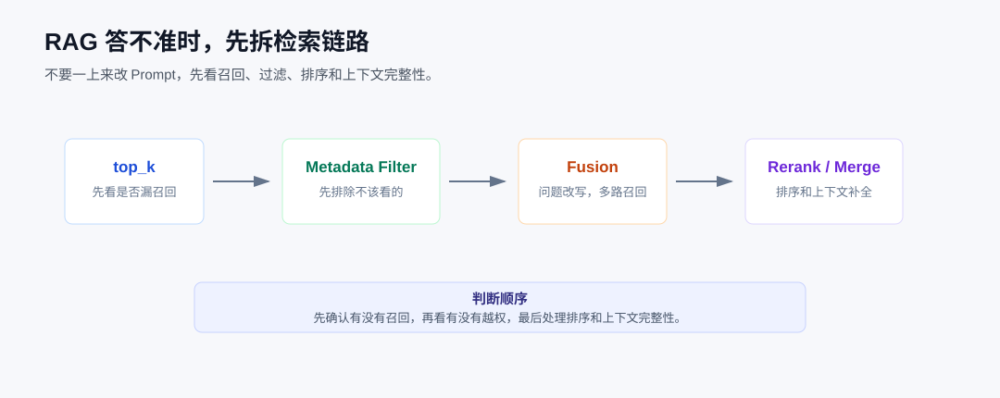

# LlamaIndex 实战：RAG 答不准怎么办？先做一个检索诊断器

做 RAG 的时候，我最怕听到一句反馈：这个答案不对。

这句话很正常，但它没法直接定位问题。文档可能没进来，切块可能切坏了，Retriever 可能没召回，也可能是模型拿到了正确上下文但回答跑偏。

所以我一般不会第一步就改 Prompt。Prompt 当然要调，但在调之前，我会先把这次检索到底拿回了什么打印出来。

这一篇就围绕这个动作做一个小工具：**检索诊断器**。

它不追求最终回答多漂亮，只解决一个问题：让我看到一次查询从问题到候选 Node 的过程。



## 先跑起来，看它到底打印什么

这篇配套了四个脚本：

```text
code/07_advanced_retrieval/01_topk_baseline.py
code/07_advanced_retrieval/02_metadata_filter.py
code/07_advanced_retrieval/03_query_fusion.py
code/07_advanced_retrieval/04_keyword_rerank.py
```

可以在 `llamaindex` 目录下运行：

```bash
cd llamaindex
python code/07_advanced_retrieval/01_topk_baseline.py
python code/07_advanced_retrieval/02_metadata_filter.py
python code/07_advanced_retrieval/03_query_fusion.py
python code/07_advanced_retrieval/04_keyword_rerank.py
```

这几个脚本会用到向量化和模型配置，需要先准备好 `.env`。如果你只想先看代码思路，可以先从第 2 个脚本看起，它的数据更小，边界也更清楚。

本篇主要用到这些导入：

```python
from llama_index.core import SimpleDirectoryReader, VectorStoreIndex
from llama_index.core.retrievers import QueryFusionRetriever
from llama_index.core.vector_stores import ExactMatchFilter, MetadataFilters
```

这里先不用急着记 API。下面会按排查顺序把它们放回代码里看。

## 第一件事：只看召回，不生成回答

`01_topk_baseline.py` 做的事情很克制：建一个索引，然后只调用 Retriever。

核心代码是这样：

```python
def build_diagnostic_index() -> VectorStoreIndex:
    documents = SimpleDirectoryReader(str(ADVANCED_DATA_DIR)).load_data()
    return VectorStoreIndex.from_documents(documents)


def inspect_retrieval(index: VectorStoreIndex, question: str, top_k: int) -> None:
    retriever = index.as_retriever(similarity_top_k=top_k)
    nodes = retriever.retrieve(question)
    print_nodes(nodes)
```

`SimpleDirectoryReader` 负责把目录里的示例文档读成 `Document`。

`VectorStoreIndex.from_documents()` 会基于这些文档构建一个向量索引。这里是内存索引，适合教程，不代表生产就应该这么放。

`index.as_retriever()` 是这一篇最关键的入口。它把 Index 转成 Retriever。

`retrieve()` 只做召回，不做回答生成。

我特意没有写：

```python
query_engine = index.as_query_engine()
response = query_engine.query(question)
```

因为那样很快就会把检索和生成混在一起。现在我只想知道：模型回答之前，到底看到了哪些材料。

运行以后，我会看三件事：

- `top_k=1` 时，关键 Node 有没有回来。
- `top_k=3` 时，正确 Node 排在第几位。
- `top_k=5` 时，无关内容是不是明显变多。

`top_k` 不是越大越好。它变大以后，正确资料可能回来了，噪声也可能一起进来。很多线上 RAG 问题，就是在“漏召回”和“召回太杂”之间来回摆。

## 权限和版本，不要交给 Prompt

第二个脚本是 `02_metadata_filter.py`。

真实知识库里，文档经常不是一类：公开文档、内部复盘、不同租户、不同部门、不同版本，都可能在同一个系统里。

这类边界要尽量在检索阶段处理，而不是让模型看完以后再“自觉一点”。

代码里先构造了几段带 metadata 的文档：

```python
Document(
    text="E-401 对外只需要解释为权限不足，请联系管理员确认账号分组。",
    metadata={"team": "support", "visibility": "public"},
)
```

然后加过滤条件：

```python
def build_public_filter() -> MetadataFilters:
    return MetadataFilters(filters=[ExactMatchFilter(key="visibility", value="public")])


filtered_retriever = index.as_retriever(
    similarity_top_k=3,
    filters=build_public_filter(),
)
```

`MetadataFilters` 是一组过滤条件。

`ExactMatchFilter` 表示某个 metadata 字段必须精确等于指定值。

这里的意思很直接：只允许 `visibility=public` 的内容进入候选结果。

脚本会先打印不过滤的结果，再打印过滤后的结果。你要看的不是答案，而是内部文档有没有被挡住。

这个习惯很重要。权限、租户、版本这些东西，如果已经进入了 LLM 上下文，再靠 Prompt 兜底就晚了。

## 问法不稳定时，再看 Query Fusion

有些问题不是 `top_k` 的问题，而是问法太容易漂。

比如故障码、模块名、内部缩写、产品编号。它们不一定和文档正文在语义上很像，但它们有明确事实关系。

这时可以看 `03_query_fusion.py`：

```python
base_retriever = index.as_retriever(similarity_top_k=3)
fusion_retriever = QueryFusionRetriever(
    retrievers=[base_retriever],
    llm=Settings.llm,
    similarity_top_k=3,
    num_queries=3,
    use_async=False,
    verbose=True,
)
```

`QueryFusionRetriever` 会基于原始问题生成多个查询版本，再合并结果。

`retrievers` 里放的是底层 Retriever。示例里只有一个向量 Retriever，真实项目里也可以组合关键词检索、向量检索、外部搜索。

`num_queries` 控制生成多少个查询版本。

`llm` 会参与问题改写，所以它不是免费的能力。调用成本、耗时、稳定性都要算进去。

我通常在这类场景里测试 Query Fusion：用户问法差异大，但背后问的是同一批事实。如果只是普通 FAQ，先别急着上这层，基础检索做稳更重要。

## rerank 不是补救漏召回

第四个脚本是 `04_keyword_rerank.py`。

这里用关键词分数做了一个很小的 rerank：

```python
def rerank_by_keywords(nodes, keywords: list[str]):
    return sorted(
        nodes,
        key=lambda item: keyword_score(item.node.get_content(), keywords),
        reverse=True,
    )
```

这个例子不是建议你生产里手写排序模型，而是为了看清 rerank 的位置。

它发生在 Retriever 之后：

```text
Retriever -> candidates -> rerank -> answer
```

如果正确 Node 根本没被召回，rerank 没法凭空变出来。

如果正确 Node 已经在候选里，只是排在第三、第四位，rerank 才有意义。

这也是我排查 RAG 时很在意的一点：先分清楚是“没召回”，还是“召回了但排得不好”。这两个问题的处理方式不一样。

## 这套东西放到项目里怎么用

我会把检索诊断器放在项目早期。

每次改 chunk、metadata、top_k、fusion、rerank，都拿固定问题集跑一遍。不要只看最终回答，要看命中的 Node、score、metadata 和排序变化。

上线以后，也建议把这些信息写进日志：

```text
question
retrieved node ids
score
metadata
filters
rerank order
```

等用户反馈“答案不对”时，你至少能知道问题从哪一层开始查。

下一篇继续往前走。不是所有问题都适合找相似文本。有些问题问的是依赖、影响和职责，这时就要看 GraphRAG。

