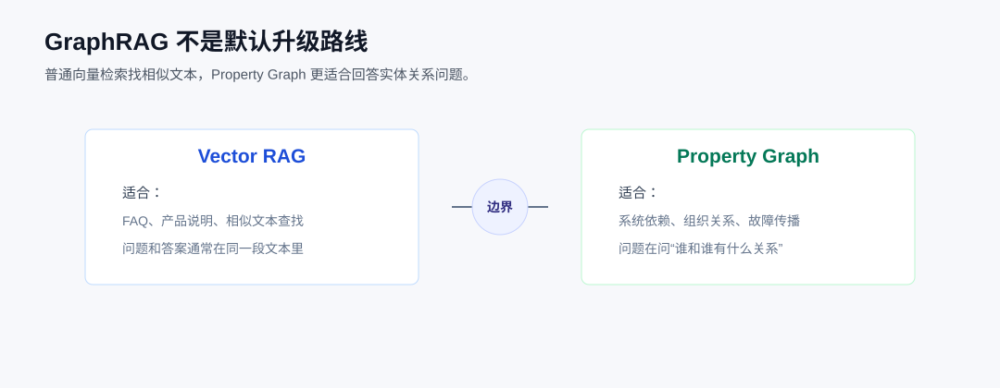

# LlamaIndex 实战：向量检索解决不了关系问题？做一个能跑的最小 GraphRAG

第七篇我们做了一个检索诊断器，主要看 Retriever 有没有把正确文本找回来。

这一步很重要。大多数 RAG 问题，确实先要从召回、过滤、排序这些地方排查。

但项目做久了，会遇到另一类问题。用户不是问“哪段资料里写了这个”，而是在问“谁和谁有什么关系”。

比如：

```text
Agent 工作台依赖哪些服务？
文档解析服务异常，会影响哪些模块？
检索服务是谁负责的？它提供哪些能力？
张明维护哪些能力？这些能力和哪个服务有关？
```

这类问题用向量检索也能找到相关文本，但答案不一定稳。因为向量检索擅长找相似片段，不擅长稳定地走依赖链、负责人链、影响链。

所以这一篇不先讲概念，也不直接把 `PropertyGraphIndex` 扔出来。我们先做一个最小闭环：

```text
图谱查关系
向量检索查证据
路由函数决定走哪条链路
最后把结构和证据放在同一个回答里
```



## 先看最终效果

主脚本是：

```bash
cd llamaindex
python code/08_graphrag/05_hybrid_graph_vector_rag.py
```

它会读取 `llamaindex/.env`，真实调用你配置的 OpenAI 兼容 embedding 接口。

运行后会看到类似这样的结构：

```json
{
  "question": "Agent 工作台依赖哪些服务？文档解析服务异常会影响它吗？",
  "route": "graph_vector",
  "graph_answer": {
    "dependency_chain": "Agent 工作台 的依赖链路是：Agent 工作台 -> 检索服务 -> 文档解析服务。",
    "impact_chain": "文档解析服务 异常会影响：检索服务, Agent 工作台。"
  },
  "vector_evidence": [
    {
      "vector_score": 0.7592,
      "text": "Agent 工作台负责面向用户的知识库问答入口。它依赖检索服务查询产品文档...",
      "metadata": {
        "source": "service_notes",
        "entity": "Agent 工作台"
      }
    }
  ],
  "final_answer": "Agent 工作台依赖检索服务，检索服务继续依赖文档解析服务..."
}
```

这里最值得看的不是 `final_answer`，而是前面的三个字段。

`route` 说明这次问题为什么走混合链路。

`graph_answer` 是结构化关系。

`vector_evidence` 是向量检索召回的原文证据。

真实项目里，我会尽量保留这些中间结果。用户说“这个答案不对”时，我们才能知道是关系抽错了、证据召回错了，还是最后合成答案时说偏了。

## 这一篇会用到哪些脚本

第八篇的代码都在：

```text
code/08_graphrag/
```

建议按这个顺序看：

```text
03_manual_relationship_baseline.py
04_relationship_qa_app.py
05_hybrid_graph_vector_rag.py
01_property_graph_index.py
02_compare_vector_and_graph.py
```

`03` 和 `04` 不依赖模型，先用手写关系把图查询讲清楚。

`05` 会使用 `.env` 里的真实 embedding 配置，把图谱关系和向量检索合起来。

`01` 和 `02` 再进入 LlamaIndex 的 `PropertyGraphIndex`，演示从文档里构建图索引。

这个顺序比一上来讲 `PropertyGraphIndex.from_documents()` 更适合新手。先知道图要解决什么，再看框架 API 才不容易迷路。

## 第一步：先把关系写明白

知识图谱最基本的结构不复杂。

一个实体：

```python
@dataclass(frozen=True)
class Entity:
    name: str
    entity_type: str
    properties: dict[str, str] = field(default_factory=dict)
```

一条关系：

```python
@dataclass(frozen=True)
class Relation:
    subject: str
    relation: str
    target: str
    evidence: str
```

`subject -> relation -> target` 就是一条边。

在这个例子里，我们有三类实体：

```python
Entity("张明", "person", {"team": "LinAI", "role": "检索负责人"})
Entity("检索服务", "service", {"stage": "retrieval"})
Entity("Retriever", "capability", {"domain": "rag"})
```

也有几类关系：

```python
Relation("Agent 工作台", "依赖", "检索服务", "Agent 工作台依赖检索服务查询产品文档。")
Relation("检索服务", "依赖", "文档解析服务", "检索服务依赖文档解析服务提供 Markdown 文本。")
Relation("张明", "负责", "检索服务", "张明负责检索服务。")
```

这里多了一个 `evidence` 字段。

这是我在项目里会坚持保留的字段。关系本身只能说明“图上怎么连”，`evidence` 才能说明“这条边凭什么存在”。

先跑最小脚本：

```bash
python code/08_graphrag/03_manual_relationship_baseline.py
```

它只做一件事：从某个实体出发，查一跳关系。

```python
def find_related(entity: str, relation_type: str) -> list[Relation]:
    return [
        item
        for item in RELATIONS
        if item.subject == entity and item.relation == relation_type
    ]
```

比如：

```text
Agent 工作台 --依赖--> 检索服务
```

这段代码看起来很简单，但它把图查询最核心的动作讲清楚了：从一个实体出发，沿着某一种关系找到另一个实体。

真实项目里，关系不一定来自 Python 列表。它可能来自文档抽取、CMDB、工单系统、数据库表，也可能来自人工维护。但查询动作本身没有变。

## 第二步：让关系查询形成闭环

只查一跳不够。

用户通常会继续追问：

```text
Agent 工作台依赖检索服务，那检索服务又依赖谁？
文档解析服务异常，会不会影响 Agent 工作台？
检索服务谁负责？它提供哪些能力？
```

所以 `04_relationship_qa_app.py` 做了三件事：

```bash
python code/08_graphrag/04_relationship_qa_app.py
```

第一件事是查依赖链。

```python
def trace_relation_path(
    start_entity: str,
    relation_type: str,
    max_depth: int = 2,
) -> list[dict[str, object]]:
    result = []
    queue = deque([(start_entity, 0)])
    visited = set()

    while queue:
        current, depth = queue.popleft()
        if (current, depth) in visited or depth >= max_depth:
            continue
        visited.add((current, depth))

        for relation in manual.find_related(current, relation_type):
            result.append(
                {
                    "depth": depth + 1,
                    "source": relation.subject,
                    "relation": relation.relation,
                    "target": relation.target,
                    "evidence": relation.evidence,
                }
            )
            queue.append((relation.target, depth + 1))
    return result
```

这里用队列做了一次简单的路径展开。

查 `依赖` 时，可以得到：

```text
Agent 工作台 -> 检索服务 -> 文档解析服务
```

第二件事是查影响面。

生产系统里，影响面最好显式维护，不要完全依赖模型临场推理。

```python
Relation("文档解析服务", "异常影响", "检索服务", "文档解析异常会导致新文档无法进入索引。")
Relation("检索服务", "异常影响", "Agent 工作台", "检索异常会影响 Agent 工作台的知识库问答。")
```

这样当用户问：

```text
文档解析服务异常，会影响哪些模块？
```

系统可以沿着 `异常影响` 关系走，而不是只靠 LLM 从文本里猜。

第三件事是做服务画像。

排查问题时，我们通常不只想知道某个服务依赖谁，还想知道它是谁负责、提供什么能力、异常会影响谁。

```python
def answer_service_profile(service: str) -> dict[str, object]:
    return {
        "service": service,
        "owners": find_owner(service),
        "capabilities": list_capabilities(service),
        "dependencies": trace_relation_path(service, "依赖", max_depth=2),
        "impacts": trace_relation_path(service, "异常影响", max_depth=2),
    }
```

到这里，已经是一个最小关系问答系统了。

它还没有用 LlamaIndex，但它把 GraphRAG 最关键的部分讲清楚了：图谱不是直接生成答案，而是提供稳定的关系结构。

## 第三步：加一个问题路由

真实 RAG 服务里，不是所有问题都应该走图谱。

有些问题只需要查原文：

```text
检索服务的说明原文在哪里？
```

有些问题只需要查关系：

```text
Agent 工作台依赖哪些服务？
```

还有一些问题既要关系，也要证据：

```text
Agent 工作台依赖哪些服务？文档解析服务异常会影响它吗？
```

所以 `05_hybrid_graph_vector_rag.py` 里先做了一个很朴素的路由函数：

```python
def route_question(question: str) -> str:
    relation_terms = ["依赖", "影响", "负责", "负责人", "谁", "哪些服务", "哪些模块"]
    evidence_terms = ["为什么", "依据", "证据", "原文", "说明", "解释", "会影响它吗"]

    has_relation_intent = any(term in question for term in relation_terms)
    needs_evidence = any(term in question for term in evidence_terms)

    if has_relation_intent and needs_evidence:
        return "graph_vector"
    if has_relation_intent:
        return "graph"
    return "vector"
```

路由结果只有三种：

```text
vector：查说明、原文、普通事实
graph：查依赖、负责人、影响面
graph_vector：既要关系路径，也要文本证据
```

这个函数并不复杂，但它很有用。

很多教程会跳过这一步，直接把问题丢给某个 QueryEngine。真实项目里我不太建议这样做。链路不分清楚，后面排查时就会混在一起：不知道是向量没召回、图谱没命中，还是回答合成没说清楚。

路由可以先用规则。等业务问题积累多了，再换成 LLM 分类器、轻量分类模型，或者规则 + 模型的组合。

## 第四步：图谱给结构，向量给证据

现在看主链路：

```python
def answer_question(question: str) -> dict[str, object]:
    route = route_question(question)
    if route == "graph_vector":
        return answer_with_graph_and_vector(question)
    if route == "graph":
        return answer_with_graph(question)
    return answer_with_vector(question)
```

如果走 `graph_vector`，代码会同时做两件事。

先查图谱：

```python
dependency = qa_app.answer_dependency_question("Agent 工作台")
impact = qa_app.answer_impact_question("文档解析服务")
service_profile = qa_app.answer_service_profile("检索服务")
```

这里拿到的是结构化关系：依赖链、影响链、负责人和能力。

再查向量证据：

```python
text_evidence = retrieve_text_evidence(question)
```

向量索引用的是 LlamaIndex 的 `VectorStoreIndex`：

```python
from llama_index.core import Document, VectorStoreIndex

from common import configure_llamaindex


def build_vector_retriever(documents: list[Document]):
    configure_llamaindex()
    index = VectorStoreIndex.from_documents(documents)
    return index.as_retriever(similarity_top_k=5)
```

`configure_llamaindex()` 会读取：

```text
OPENAI_API_KEY
OPENAI_BASE_URL
OPENAI_MODEL
EMBEDDING_MODEL
EMBEDDING_BASE_URL
```

这不是 Mock 示例，会真实请求 embedding 接口。

为了让向量检索能找到证据，脚本会把两类内容都转成 `Document`。

第一类是服务说明：

```python
Document(
    text=(
        "Agent 工作台负责面向用户的知识库问答入口。它依赖检索服务查询产品文档、"
        "故障复盘和运维策略。"
    ),
    metadata={"source": "service_notes", "entity": "Agent 工作台"},
)
```

第二类是图谱边上的证据：

```python
Document(
    text=relation.evidence,
    metadata={
        "source": "graph_relation_evidence",
        "subject": relation.subject,
        "relation": relation.relation,
        "target": relation.target,
    },
)
```

这一步很关键。

关系本身解决“怎么连”，证据解决“凭什么这么说”。如果只保存关系，不保存证据，回答就很难审计。

## 第五步：再看 PropertyGraphIndex

上面的手写图谱是为了讲清楚问题。

真实项目不可能一直靠手写 `RELATIONS`。文档里可能是这样写的：

```text
张明负责检索服务，主要维护 Retriever、rerank 和向量索引加载逻辑。
检索服务依赖文档解析服务提供的 Markdown 文本。
Agent 工作台依赖检索服务查询产品文档和故障复盘。
```

这时就可以引入 LlamaIndex 的 `PropertyGraphIndex`。

代码在：

```bash
python code/08_graphrag/01_property_graph_index.py
```

核心代码：

```python
from llama_index.core import PropertyGraphIndex, SimpleDirectoryReader


def build_relation_graph_index() -> PropertyGraphIndex:
    documents = SimpleDirectoryReader(
        input_files=[str(GRAPH_DATA_DIR / "team_graph.md")]
    ).load_data()
    return PropertyGraphIndex.from_documents(documents, show_progress=True)
```

这里的 API 分工很清楚。

`SimpleDirectoryReader(...).load_data()` 把本地文件读成 `Document`。

`PropertyGraphIndex.from_documents()` 基于 `Document` 构建图索引。官方示例里还可以传 `llm`、`embed_model`、`kg_extractors` 等参数，用来控制实体关系抽取。

查询时：

```python
retriever = index.as_retriever(include_text=True, similarity_top_k=3)
nodes = retriever.retrieve(question)
```

`include_text=True` 我建议调试阶段打开。

做 GraphRAG 时，不要只看它返回了什么实体和关系，还要看这些关系背后的原文是否能支撑最终回答。

我通常会检查三件事：

- 实体有没有抽对，比如“检索服务”“文档解析服务”“Agent 工作台”。
- 关系有没有抽对，比如“依赖”“负责”“异常影响”。
- 返回文本能不能支撑最终回答。

如果这三件事不稳定，先别急着扩大数据量。先把 schema、样本文档和抽取提示调稳。

## 第六步：和向量检索放在一起比较

还有一个对照脚本：

```bash
python code/08_graphrag/02_compare_vector_and_graph.py
```

它用同一份文档同时建两个索引：

```python
vector_index = VectorStoreIndex.from_documents(documents)
graph_index = PropertyGraphIndex.from_documents(documents, show_progress=False)
```

这样做不是为了证明图谱比向量检索高级，而是为了看边界。

如果问题是：

```text
E-503 是什么意思？
某个策略原文怎么说？
一段说明在哪个文档里？
```

优先用向量检索。

如果问题是：

```text
谁负责谁？
哪个系统依赖哪个系统？
一个模块异常会影响哪些下游？
某个服务提供哪些能力？
```

再考虑图检索。

如果问题既问关系，又要求解释或依据，就走混合链路。

这也是 `05_hybrid_graph_vector_rag.py` 里加路由函数的原因。真实系统里，入口应该先判断问题类型，再决定检索策略。

## 项目里怎么落地

如果我要在真实项目里做 GraphRAG，不会第一步就接全量知识库。

我会先拿 20 到 50 条真实资料做一个小样本，先验证 schema。

例如：

```text
实体：service、person、capability、incident、document
关系：依赖、负责、提供能力、异常影响、引用
```

关系类型不要一开始设计太多。类型越多，抽取越难验收，错误也越难排查。

然后把关系和证据分开存。

关系用于路径查询：

```text
Agent 工作台 --依赖--> 检索服务
```

证据用于回答审计：

```text
Agent 工作台依赖检索服务查询产品文档和故障复盘。
```

查询时再按问题类型走不同链路：

```text
问定义、原文、说明 -> 先走向量检索
问依赖、负责人、影响面 -> 先走图谱
问关系并要求解释 -> 图谱 + 向量证据一起走
```

最后，输出不要只保留一段自然语言。

至少保留：

- 命中的实体。
- 走过的关系路径。
- 用到的文本证据。
- 最终回答。

这些中间结果不是给用户看的全部内容，但对排查很重要。RAG 系统一旦进入生产，能不能解释“为什么这么答”，往往比回答本身更重要。

## 这一章小结

GraphRAG 不是向量检索的替代品。

我的理解是：

```text
向量检索解决“哪段文本相关”
图谱检索解决“实体之间怎么连”
混合链路解决“既要结构，也要证据”
```

这也是第八章想建立的边界。

下一篇会继续往前看文档解析。因为不管后面是向量索引，还是图索引，前提都是资料进系统时没有被解析坏。PDF、表格、扫描件如果一开始就变成脏文本，后面的检索链路再完整，也很难稳定。 
