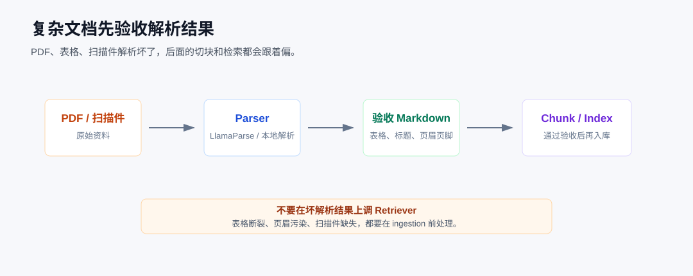
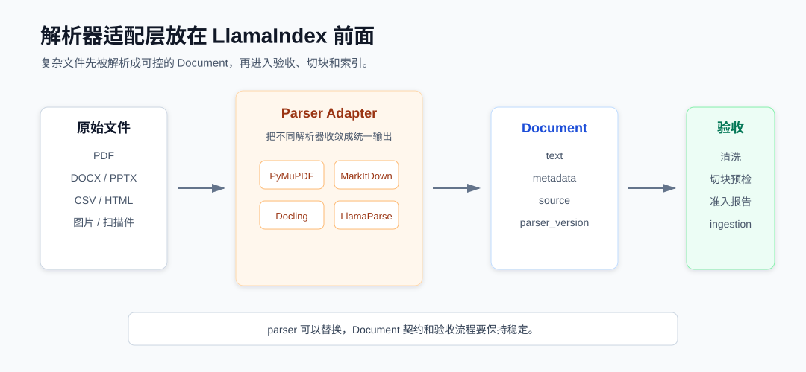

# LlamaIndex 实战：文件读出来了，知识库还是可能答不准

知识库答不准，不一定是检索出了问题。

前面几篇我们一直在往 RAG 链路后面走：第七篇看 Retriever，第八篇看关系检索和向量检索怎么配合。但项目里还有一个更靠前的问题，资料真的被正确读进来了吗？

我以前排查过一个类似问题。用户问的是一个很明确的错误码，知识库也确实收录了那份 PDF，可回答就是不稳定。后来把 `source_nodes` 打开看，命中的片段里一半是正文，一半是页脚、页码和导出的水印。模型不是没能力，它只是拿到了一份不太像资料的资料。

表格类文件也一样。CSV、Excel 如果直接压成一段文本塞进向量库，短期看能跑，长期看会很难维护。你想查“哪个模块的失败任务最多”，它可能命中整张表；你想做引用，引用粒度又太粗；你想按 `module` 过滤，metadata 里根本没有这个字段。

所以这一篇我不继续讲检索调参，而是把入口往前挪一挪：文件进知识库之前，先验收。

这次写的代码是一个小型的 **文件入库验收器**。它不会直接回答用户问题，也不会马上建索引，只负责把目录里的文件读出来，清洗一下，补齐 metadata，再判断这份内容现在能不能进入 ingestion。



这篇先只处理文件类资料：Markdown、TXT、CSV、HTML、PDF。Word、Excel、PPT 这类复杂版式文件也会讲处理策略，但不会在这一篇硬塞完整实现。图片、扫描件、音视频，我放到后面的多模态章节单独写。

## 先跑起来

代码在第九章目录下，主脚本是：

```bash
cd llamaindex
python code/09_document_parsing/07_file_acceptance_app.py
```

样本文件放在 `data/file_docs/`。我没有只放一个很干净的 Markdown 文件，那样演示不出问题。这个目录里放了几类更像项目现场会遇到的资料：

| 文件 | 我想模拟的情况 |
| --- | --- |
| `product_guide.md` | 产品手册，里面有故障码、权限说明、上线检查 |
| `ops_runbook.txt` | 运维手册，偏流程和排查步骤 |
| `metrics.csv` | 指标表，不适合直接整表入库 |
| `help_page.html` | 网页导出，正文外面带导航和页脚 |
| `release_review.pdf` | 一份索引发布复盘 PDF |
| `broken_export.md` | 故意做坏的解析结果，用来验证拦截逻辑 |

脚本跑完会输出一份 JSON 报告。完整内容比较长，先看结论部分：

```json
{
  "summary": {
    "files": 6,
    "documents": 12,
    "accepted": 11,
    "needs_review": 0,
    "rejected": 1
  },
  "ingestion_ready": [
    "help_page.html",
    "metrics.csv#row-1",
    "release_review.pdf#page-1"
  ],
  "blocked": [
    "broken_export.md"
  ]
}
```

这里我最想看的不是 `files=6` 这种统计数字，而是 `ingestion_ready` 和 `blocked`。一个文件到底是继续往后走，还是先停下来修解析策略，报告里要说清楚。否则到了线上，用户反馈“知识库乱答”，我们再回头翻原始文件、翻索引、翻日志，成本会高很多。

## LlamaIndex 在这一步能帮什么

这一篇用到的 LlamaIndex API 不多，但都比较基础。

```python
from llama_index.core import Document, SimpleDirectoryReader
from llama_index.core.node_parser import SentenceSplitter
from llama_index.core.readers.base import BaseReader
```

`SimpleDirectoryReader` 用来读本地目录。它适合做统一入口，至少不用自己从头写一套目录扫描。

`Document` 是最重要的对象。文件被读进来以后，正文放在 `text` 里，来源、文件类型、页码、行号这些信息放在 `metadata` 里。后面切块、索引、引用来源，都要从这里开始。

`SentenceSplitter` 在这篇里不是为了正式切块入库，而是提前看一下文本被切开以后大概是什么样。解析出来的内容如果本身很碎、很短、全是噪声，切块阶段只会把问题放大。

`BaseReader` 用来扩展自定义 reader。CSV、HTML、PDF 这三类文件，我没有全部交给默认读取逻辑，而是自己接管了一部分。

我不太建议把 LlamaIndex 理解成“文件丢进去就自动变成知识库”。它提供的是一套基础设施。文件怎么读、metadata 怎么设计、坏数据怎么拦，还是要结合项目自己定。

## 我会先做文件清单，而不是先读正文

真实项目里的上传目录通常不干净。可能有临时文件、旧版本文件、压缩包、导出中间产物，也可能有当前版本还不支持的格式。如果任务一启动就递归读取，很容易把不该入库的东西带进去。

所以脚本里先做 manifest。相关函数很简单：

```python
SUPPORTED_EXTS = [".md", ".txt", ".csv", ".html", ".pdf"]

def choose_strategy(extension: str) -> str:
    if extension in {".md", ".txt"}:
        return "SimpleDirectoryReader"
    if extension == ".pdf":
        return "LocalPdfReader via file_extractor"
    if extension == ".csv":
        return "CsvMetricReader via file_extractor"
    if extension in {".html", ".htm"}:
        return "ArticleHTMLReader via file_extractor"
    if extension in {".docx", ".pptx", ".xlsx"}:
        return "LiteParse/LlamaParse or project-specific reader"
    return "unsupported"
```

这段代码的重点不是 Python 写法，而是把文件策略显式写出来。

Markdown、TXT 可以先用 `SimpleDirectoryReader`。普通 PDF 可以先本地解析。CSV 最好按行或按业务记录拆。HTML 先抽正文。Word、PPT、Excel 这类文件要看情况，本地解析、LiteParse、LlamaParse、企业内部解析服务，都可能用得上。

这里顺便把边界说清楚：不是所有文件都要上传到 LlamaCloud。有些项目文件很敏感，只能内网处理；有些项目更看重表格和版式还原，可以接受云端解析。架构上先把 parser 当成可替换组件，后面选择空间会大很多。

## 统一入口还是要有

虽然不同文件会走不同策略，但入口不要写散。

主脚本里仍然用 `SimpleDirectoryReader` 统一加载目录，只是用 `file_extractor` 接管特殊类型：

```python
reader = SimpleDirectoryReader(
    input_dir=str(input_dir),
    required_exts=SUPPORTED_EXTS,
    recursive=False,
    file_extractor={
        ".csv": CsvMetricReader(),
        ".html": ArticleHTMLReader(),
        ".pdf": LocalPdfReader(),
    },
)
documents = reader.load_data()
```

这里有几个细节。`required_exts` 是第一道边界，不在支持范围内的文件先不读。`file_extractor` 是扩展点，默认 reader 适合简单文本，但 CSV、HTML、PDF 最好按自己的结构来读。`load_data()` 返回的是 `Document` 列表，后面的清洗、补 metadata、验收，全部围绕这批 `Document` 做。

这个结构以后也好换。今天 PDF 用 PyMuPDF，后面换 LlamaParse，只要最后返回 `Document`，后面的验收规则不用重写。

## PDF 重点不是抽字，而是能追踪

PDF 最容易让人误判。很多时候我们看到“能抽出文字”，就觉得可以入库了。但真正到问答场景里，用户经常会追问来源：哪份文件，哪一页，哪一段。

所以示例里的 `LocalPdfReader` 是按页生成 `Document`。

核心 metadata 是这样的：

```python
metadata = {
    "source": path.name,
    "file_type": ".pdf",
    "asset_type": "pdf_page",
    "document_id": f"{path.name}#page-{page_index}",
    "page_number": page_index,
    "page_count": pdf.page_count,
}
```

我不建议把一整份 PDF 合成一个超大的 `Document`。短期省事，后面排查来源会难受。按页保留 `document_id` 和 `page_number`，至少能把答案追回原文件。

当然，PyMuPDF 只是本地解析的基础方案。遇到多栏排版、复杂表格、扫描版 PDF，就要换更强的 parser。可以是 LiteParse，可以是 LlamaParse，也可以是公司内部已有的文档解析服务。但无论前面用什么工具，后面这道验收门都应该保留。

## CSV 要按业务记录处理

CSV 这类表格文件，我一般不会整张表直接入库。这一篇的 `metrics.csv` 大概长这样：

```csv
module,metric,value,unit,owner
ingestion,failed_jobs,3,count,ops
query,avg_latency_ms,280,ms,platform
parser,empty_body_files,2,count,data
```

如果整张表变成一段文本，模型也许能回答，但不稳定，来源也不好看。

所以 `CsvMetricReader` 会把每一行变成一个 `Document`。比如第一行会带上这些 metadata：

```text
document_id = metrics.csv#row-1
asset_type = table_row
module = ingestion
metric = failed_jobs
row_number = 1
```

这样做以后，后面做检索会更干净。用户问 query 模块平均延迟，系统应该命中 `metrics.csv#row-2`，而不是把整张 CSV 扔进上下文让模型自己猜。

这也是我做表格入库时比较坚持的一点：能结构化就先结构化，不要过早把结构压扁成普通文本。

## HTML 先把正文拿干净

网页导出文件也很常见。它的问题不是读不出来，而是读出来太多。导航、登录入口、下载按钮、页脚、版权信息，这些东西如果混进知识库，检索阶段可能都会被召回。

示例里的 `help_page.html` 故意放了这些噪声。真正要入库的是 `<article>` 里的内容。

所以我写了一个 `ArticleHTMLReader`，只取正文区域，再构造 `Document`。

真实项目里可以更细：保留 URL、栏目、发布时间、站点名，也可以根据不同站点写不同抽取规则。但最底层的原则不变：

网页可以入库，整页 HTML 不应该直接入库。

这句话看起来普通，但很多知识库问题就卡在这里。

## metadata 不要随手写

文件读出来以后，我会统一补齐 metadata。这个示例里，每个 `Document` 至少会有：

- `document_id`
- `source`
- `file_type`
- `extension`
- `asset_type`
- `parser_version`
- `stage`

这些字段后面都会用到。

`document_id` 用来定位和去重。`source` 用来展示来源。`file_type`、`extension` 用来排查解析策略。`asset_type` 会影响后面的切块和路由。`parser_version` 用来标记这批内容由哪个解析策略生成。`stage` 表示它现在还在验收阶段，没有真正入库。

我现在越来越倾向于把 metadata 当成知识库的数据契约。前期随便写，后期权限过滤、来源引用、评估日志、增量更新都会补课。

## 规则先跑起来

文件验收不一定一开始就上复杂模型。很多低级问题，规则就能拦住。

比如正文太短、噪声太多、表格明显坏了、HTML 没有抽到正文、CSV 缺关键字段、metadata 不完整。

脚本里的准入判断很朴素：

```python
def decide(warnings: list[str], score: int) -> str:
    if not warnings:
        return "accepted"
    if score >= 5 or "body_missing" in warnings:
        return "rejected"
    return "needs_review"
```

这不是一个完美的质量评估系统，但它能先把流程立住：哪些文件能进，哪些文件要人工复核，哪些文件必须重解析。

我在项目里更怕另一种情况：解析其实已经失败了，但系统没有任何提示，还是把内容写进了向量库。后面用户问答出错，排查路径会被拉得很长。

## 看报告，不要只看最终数字

脚本输出里每个文档都有检查结果。我一般会先看 `decision`、`warnings`、`next_action`。

坏文件会被拦下来：

```json
{
  "source": "broken_export.md",
  "warnings": ["page_noise", "broken_table", "body_missing"],
  "decision": "rejected",
  "next_action": "暂停入库，先修复解析或清洗策略"
}
```

PDF 复盘报告会通过：

```json
{
  "source": "release_review.pdf",
  "document_id": "release_review.pdf#page-1",
  "asset_type": "pdf_page",
  "decision": "accepted",
  "next_action": "进入 ingestion"
}
```

这份报告要回答的其实就一个问题：

**这批文件现在能不能进入知识库。**

如果答案说不清楚，后面建索引、做检索、调 Prompt 都会变得被动。

## 解析器这一层，最好留成可替换

这一篇主线用本地解析，因为我希望示例能直接跑。但实际项目里，复杂版式文件迟早会出现。PDF 里有复杂表格，Word 里有标题层级，PPT 里有备注，Excel 里有多个 sheet。这些内容如果解析不好，后面 RAG 效果会明显受影响。

所以我一般不会把 LlamaIndex 当成唯一的文件解析工具。

更稳定的做法，是在 LlamaIndex 前面加一层 parser adapter。



这一层可以先很简单，也可以后面慢慢换。

我会按文件情况做选择：

- `PyMuPDF`：放在本地 PDF reader 里，适合普通 PDF，按页抽文本。
- `MarkItDown`：放在文件转 Markdown 这一步，适合 Office、PDF、网页等快速转换。
- `Docling`：放在文档解析 reader / node parser 这一层，适合复杂 PDF、DOCX、PPTX、图片等资料。
- `LiteParse`：放在本地 parser 这一层，适合文件敏感、内网部署、希望保留空间信息的场景。
- `LlamaParse / LlamaCloud`：放在云端 parser 这一层，适合复杂版式、表格多、需要更好 Markdown 结构的场景。

这里不要理解成“项目一开始就要全接上”。

我通常会先用最轻的方案跑通闭环。等发现某类文件解析质量不够，再替换对应 parser。

MarkItDown 的接法比较直接，适合先把文件转成 Markdown，再包装成 LlamaIndex 的 `Document`：

```python
from markitdown import MarkItDown
from llama_index.core import Document

converter = MarkItDown()
result = converter.convert("example.docx")

document = Document(
    text=result.text_content,
    metadata={
        "source": "example.docx",
        "parser": "markitdown",
        "format": "markdown",
    },
)
```

这里的关键是把外部解析结果重新收敛到 LlamaIndex 的 `Document`。只要最后产物是 `Document`，后面补 metadata、验收、切块、索引的流程就不用变。

Docling 会更进一步。它本身有 LlamaIndex 方向的集成，可以用 `DoclingReader` 读文档，也可以配合 node parser 继续切块。项目里如果 PDF、Word、PPT 很多，我会优先评估这类工具，而不是只靠默认 reader。

```python
from llama_index.core import VectorStoreIndex
from llama_index.core.node_parser import MarkdownNodeParser
from llama_index.readers.docling import DoclingReader

reader = DoclingReader()
node_parser = MarkdownNodeParser()

documents = reader.load_data("example.pdf")
index = VectorStoreIndex.from_documents(
    documents,
    transformations=[node_parser],
)
```

因为这里真正重要的不是“能不能抽出文字”，而是标题、段落、表格、图片说明这些结构能保留多少。

如果项目可以使用云端解析，LlamaParse / LlamaCloud 也可以放在 parser 阶段。我不会在主流程里把它写死，只把它当成一个可替换的解析入口：文件先进入 parser，得到 parsed result；解析结果再进 acceptance gate，然后才是 ingestion、chunk、index。

Parser 很重要，但它不是整套 RAG。解析之后不验收，仍然可能把坏内容带进知识库。

## 最后落到项目里

如果我要把这套东西接到一个真实知识库项目里，会把它放在 ingestion 前面，作为一个独立任务。上传文件后不直接入库，先生成 manifest，看文件类型和解析策略；然后读文件，构造 `Document`，统一 metadata；再跑质量规则，输出准入报告。

我现在做知识库，会默认把文件验收当成 ingestion 的前置任务，而不是出了问题再回头查原文件。只有 `accepted` 的文档进入后续 ingestion，`needs_review` 进人工复核，`rejected` 直接拦住，并把原因记录下来。

每次新增一种文件类型，我不会先问“怎么让它进入向量库”，而是先补三件事：reader 怎么读，metadata 怎么定，验收规则怎么写。

这篇的代码不算复杂，但它解决的是一个很真实的问题：别让坏文件悄悄进入知识库。下一篇再看 Workflow。因为当 RAG 开始需要判断、重试、外部调用和过程记录时，一个简单的 `query()` 入口就不够用了。
