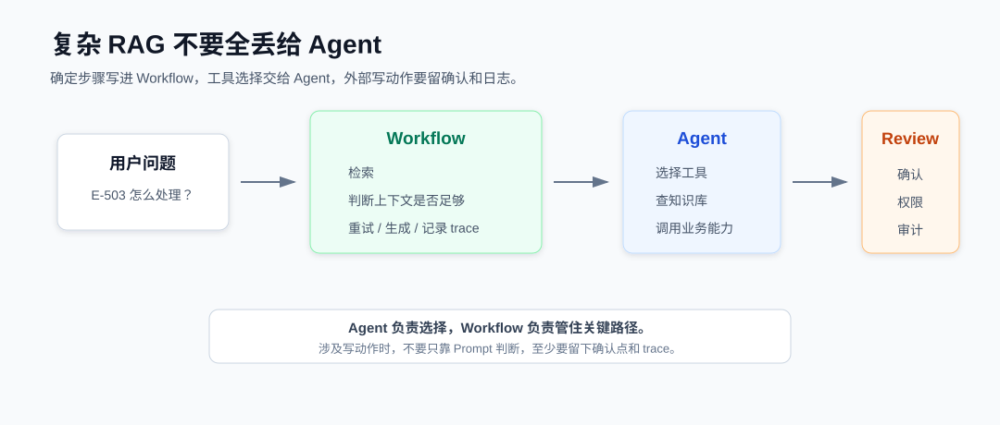

# LlamaIndex 实战：用 Workflow 管住 RAG 的检索、重试和工单动作

RAG 一旦接进业务系统，就不再只是“检索一下，然后让模型回答”。第九篇讲文件入库验收，是在处理 RAG 链路最前面的稳定性问题：坏文件不要悄悄进入知识库。

文件进来以后，另一个问题很快会出现。真实系统里经常会多几步：先检索知识库，再判断上下文够不够；不够就扩大范围或重试；回答里如果提到旧索引、构建失败、权限异常，还可能要创建复核工单；最后还要留下这次处理链路，方便后面排查。

这类流程如果全部交给 Agent 自己发挥，Demo 阶段看起来很省事，项目里会慢慢变得不可控。它到底查了几次？为什么要建工单？是哪段上下文触发了复核？如果这些问题回答不上来，线上排查会很被动。

第五章已经讲过 Workflow 的基本事件流，这一篇就不重复讲“怎么把 step 串起来”了。我更想看它进入真实业务系统以后，要帮我们管住哪些问题。我的边界会很明确：Workflow 管流程，Agent 管选择。

这一篇会做一个小型的客服 RAG 处理器。用户问 `E-503` 怎么处理，并要求复核工单；系统先走受控 RAG，必要时重试检索，最后根据回答和问题决定下一步动作。



## 先看最终要跑出什么

主线脚本是：

```bash
cd llamaindex
python code/10_agent_workflow_advanced/04_support_case_workflow.py
```

运行时会先打印检索重试日志，然后输出一段 JSON。JSON 里最关键的是这几个字段：

```json
{
  "question": "E-503 怎么处理？需要复核工单。",
  "answer": "E-503 通常表示索引构建任务未完成，需要检查 ingestion job 和查询服务加载的索引版本。",
  "trace": [
    "attempt=2",
    "top_k=3",
    "contexts=3",
    "enough=True"
  ],
  "used_context": "E-401 表示权限不足...",
  "next_action": "create_review_ticket",
  "risk_level": "medium",
  "action_reasons": [
    "user_requested_review",
    "answer_mentions_stale_index"
  ],
  "action_payload": {
    "idempotency_key": "...",
    "title": "知识库回答需要复核"
  },
  "audit_log": {
    "workflow": "ControlledRagWorkflow",
    "action_decider": "evaluate_next_action:v1"
  }
}
```

这里我最关心的不是回答本身，而是 `trace`、`next_action`、`action_payload` 和 `audit_log`。`trace` 说明这次检索不是一次命中，而是第一次上下文不够，扩大 `top_k` 后又检索了一次。`next_action` 说明系统没有只是回答用户，还判断出了需要创建复核工单。

`action_payload` 是准备交给外部系统的载荷，里面会有工单标题、原因和幂等键。`audit_log` 则是留给排查和审计看的：这次是哪个 Workflow 跑出来的，下一步动作由哪个决策函数给出。

这个输出才像一个可以接进业务系统的处理结果。它不只是“模型说了什么”，还说明“系统为什么这么处理”，以及后面要不要触发外部动作。

## 项目里真正麻烦的不是调用模型

如果只是问答，`query()` 已经能解决很多问题。复杂 RAG 麻烦的地方，往往在模型回答之外。

比如客服系统里，用户问“E-503 怎么处理”，这只是查询；如果用户接着说“帮我建一个复核工单”，事情就变了。系统要判断这是不是写动作、有没有权限、是否需要人工确认、工单重复提交怎么办、后面怎么查这次动作是谁触发的。

这些问题不适合都塞进 Prompt。我在项目里一般会把它拆成几类：

- 检索质量问题：上下文够不够，需不需要重试。
- 业务动作问题：只是回答，还是要创建工单、发送通知。
- 风险控制问题：写动作是否需要确认，是否需要幂等。
- 排查审计问题：后面能不能复盘 trace、上下文和动作原因。

第十章的 Workflow 就是为了解决这些问题，而不是为了多写几个 `@step`。这一章还有三个辅助脚本：

- `01_multi_tool_agent.py`：只用来说明 Agent 的工具选择边界，需要 `.env` 里的模型配置，不是这一章主线。
- `02_workflow_with_review.py`：看外部动作为什么要先进入 review。
- `03_workflow_retry.py`：看检索、判断、重试、生成怎么拆成 Workflow。

如果只是先理解第十章主线，我建议先跑 `04_support_case_workflow.py`，再回头看 `03_workflow_retry.py`。

## 为什么不用一个大 Agent

Agent 适合处理不确定性。用户说一句话，系统要判断是查知识库、建工单、发通知，还是调用某个业务 API，这种选择可以交给 Agent。第一个脚本里就是这个思路：把普通 Python 函数包装成 Agent 工具。

```python
tools = [
    FunctionTool.from_defaults(fn=query_incident),
    FunctionTool.from_defaults(fn=create_ticket),
]
```

`FunctionTool.from_defaults()` 会把普通 Python 函数包装成 Agent 可以调用的工具。`FunctionAgent` 会根据用户问题选择工具，比如先查故障码，再判断是否需要调用创建工单的工具。

这个能力很有用，但我不会把整条业务流程都交给它。Agent 选错工具不可怕，可怕的是它选错以后直接执行了写动作。比如“创建工单”“删除索引”“发送通知”这类动作，最好不要只靠模型一句判断就执行。工具可以交给 Agent 选，流程边界要由代码控制。

这也是第十章和前面 Agent 示例最大的区别：我们不是为了展示 Agent 很聪明，而是为了让复杂流程更可观察。

## Workflow 适合管确定步骤

`03_workflow_retry.py` 是这一篇最核心的脚本。它把 RAG 处理拆成几步：

```text
start -> retrieve -> judge -> synthesize
```

看起来只是多写了几个类，但它解决的是项目里的可控性问题。先定义事件：

```python
class RetrieveEvent(Event):
    question: str
    attempt: int
    top_k: int


class JudgeEvent(Event):
    question: str
    attempt: int
    top_k: int
    contexts: list[str]
```

`Event` 是步骤之间传递的数据。这里我不会直接传一个大字典，因为过几个月回头看时，很难知道每一步到底需要什么字段。事件类型写清楚以后，流程会更容易维护。

`Workflow` 本身是流程容器，`@step` 标记一个步骤，`StartEvent` 是入口，`StopEvent` 是出口。这些 API 看起来简单，但组合起来可以把流程拆得很清楚。

示例里的 `retrieve()` 会接收 `RetrieveEvent`，调用 `retrieve_contexts()`，再返回 `JudgeEvent`。这里的 `retrieve_contexts()` 用固定文本模拟 Retriever。不是因为真实项目会这么写，而是这一篇先讲 Workflow 控制逻辑，不把向量库、embedding、rerank 全部混进来。

## 重试不要藏在大函数里

这章最值得看的其实是 `judge()`，因为它决定系统什么时候应该停下来重试，而不是硬答。

```python
@step
async def judge(self, ev: JudgeEvent) -> RetrieveEvent | SynthesizeEvent:
    enough = any("E-503" in item and "索引构建" in item for item in ev.contexts)
    if not enough and ev.attempt < 2:
        return RetrieveEvent(question=ev.question, attempt=ev.attempt + 1, top_k=3)
```

第一次检索只取 `top_k=1`，如果上下文里没有同时出现 `E-503` 和“索引构建”，说明材料还不够。这个时候流程不是硬着头皮生成回答，而是返回一个新的 `RetrieveEvent`，扩大 `top_k` 后再走一次检索。这个动作如果写在一个大函数里也能实现，但排查时会很难看清楚。放到 Workflow 里，重试变成流程的一部分，后面可以记录、观测，也方便替换策略。

比如真实项目里，`judge()` 可以继续升级：

- 判断 source 是否来自可信文档。
- 判断上下文是否覆盖故障原因和处理步骤。
- 判断是否需要切到 GraphRAG。
- 判断是否需要进入人工复核。

第十章不把这些全部写进去，但要先把位置留出来。

## 客服闭环怎么串起来

`04_support_case_workflow.py` 把受控 RAG 和外部动作判断串在一起。现在这段代码不只是返回 `next_action`，还会返回风险等级、触发原因、工单载荷和审计日志。核心流程可以先看这几行：

```python
async def run_support_case(question: str) -> dict[str, object]:
    workflow = workflow_retry.ControlledRagWorkflow(timeout=30)
    rag_result = await workflow.run(question=question)
    answer = rag_result["answer"]
    action = evaluate_next_action(question, answer)

    return {
        "answer": answer,
        "trace": rag_result["trace"],
        "next_action": action["next_action"],
        "action_reasons": action["reasons"],
        "audit_log": {"workflow": "ControlledRagWorkflow"},
    }
```

这里的 `workflow.run()` 是真正执行受控 RAG 的地方。它返回的不只是 `answer`，还有 `trace` 和 `used_context`。完整脚本里还会根据 `next_action` 构造 `action_payload`，里面带 `ticket_id` 和 `idempotency_key`。`evaluate_next_action()` 现在是一个很简单的规则函数：

```python
def evaluate_next_action(question: str, answer: str) -> dict[str, object]:
    reasons: list[str] = []
    if "工单" in question or "复核" in question:
        reasons.append("user_requested_review")
    if "旧索引" in answer:
        reasons.append("answer_mentions_stale_index")
```

真实项目里，这里可以换成更严谨的策略，比如看用户权限、故障级别、是否涉及外部动作、是否已有同类工单。示例先用规则，是为了把边界讲清楚：RAG 负责形成可解释的回答，业务流程负责决定下一步动作。我不希望这个判断藏在 Prompt 里。因为一旦它影响外部系统，就应该进入可测试、可审计的代码。

还有一个细节容易被忽略：外部写动作要考虑幂等。用户刷新页面、前端重试、任务队列重复投递，都可能导致同一请求被执行两次。示例里的 `build_review_ticket()` 会生成一个 `idempotency_key`，实际接工单系统时，这个字段可以用来避免重复创建。

## Review 不是形式主义

`02_workflow_with_review.py` 很短，但它表达了一个重要边界：涉及外部动作时，不要默认直接执行。示例里如果问题包含“创建工单”，流程会先进入 `NeedReviewEvent`：

```python
class NeedReviewEvent(Event):
    question: str
    draft: str
```

这类事件在项目里很有用。你可以把它接到人工审核、权限校验、审批流，或者至少写一条审计日志。我现在会把这类动作分成两类：

- 只读动作：查询知识库、查询状态、读取日志。
- 写动作：创建工单、删除索引、发送通知、修改权限。

只读动作可以相对宽松，写动作一定要有明确边界。Workflow 适合把这个边界写出来。

## 跑完以后看什么

运行 `03_workflow_retry.py`，会看到类似输出：

```text
第 1 次检索：top_k=1，contexts=1
上下文不足：扩大 top_k 后重试。
第 2 次检索：top_k=3，contexts=3
```

这几行日志比最终回答更有价值。它告诉我们系统为什么没有第一次就回答，而是选择了重试。运行 `04_support_case_workflow.py` 时，我会重点看这些字段：

- `trace`：这次检索链路怎么走。
- `used_context`：回答用到了哪些上下文。
- `next_action`：是否要进入外部动作。
- `action_reasons`：为什么要进入这个动作。
- `audit_log`：后面排查时用什么线索复盘。

这些字段上线后都应该留下来。用户反馈“这个回答不对”时，先看 trace，再看 used_context，最后再看生成逻辑。用户反馈“为什么创建了工单”时，就看 action_reasons 和 audit_log。不要一上来就改 Prompt。

## 我会怎么落到项目里

如果把第十章这套东西接到真实项目，我会把流程拆成几层。确定性的主流程放进 Workflow：检索、判断、重试、生成、复核、记录。不确定的工具选择交给 Agent：用户到底是要查知识库、创建工单，还是调用其他业务能力。

外部写动作要单独加边界：需要权限、需要确认、需要日志，至少要能追踪是谁触发的、基于什么上下文触发的。

动作执行再往后接真实系统：工单系统、通知系统、审计系统、任务队列。这里要关心的不只是“能不能调通 API”，还要关心失败重试、幂等键、超时、重复提交和人工复核。

这也是我对复杂 RAG 的基本判断：不要把所有东西都塞进一个 Agent，也不要把所有逻辑写成一个大函数。Agent 负责选择，Workflow 负责把关键路径管住。只要 RAG 开始触发外部动作，我就不会再把它当成一次普通问答，而会把它当成一个业务流程来设计。

到这里，RAG 就不只是问答链路了，而是一条可以被追踪、被审核、能接业务系统的处理流程。
